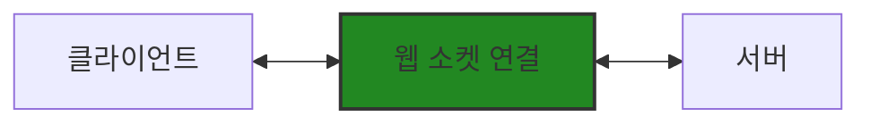
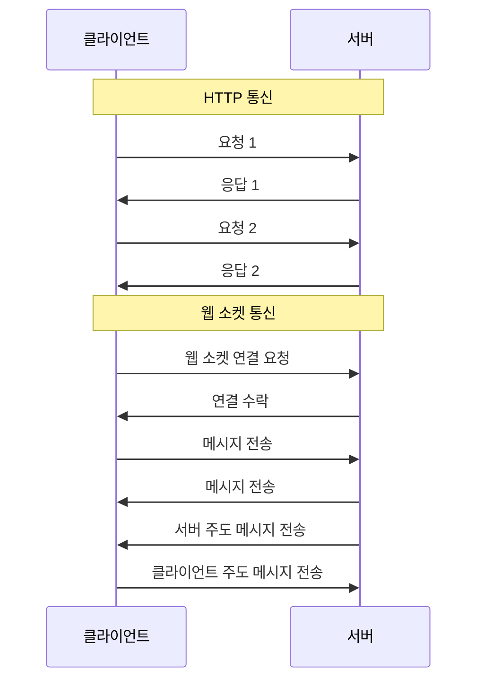
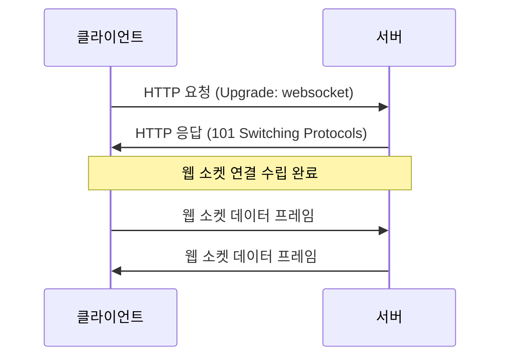

# Chapter 01 웹 소켓 소개

## 01-1 웹 소켓이란 무엇인가

### 개요
웹 소켓(WebSocket)은 웹 브라우저와 서버 간의 양방향 실시간 통신을 가능하게 하는 프로토콜입니다. 이 섹션에서는 웹 소켓의 기본 개념, 기존 HTTP 통신과의 차이점, 그리고 웹 소켓 프로토콜의 주요 특징에 대해 알아봅니다. 웹 소켓이 어떻게 현대 웹 애플리케이션의 실시간 기능을 지원하는지 이해할 수 있습니다.

### 웹 소켓의 정의와 역할

웹 소켓은 단일 TCP 연결을 통해 전이중(full-duplex) 통신 채널을 제공하는 컴퓨터 통신 프로토콜입니다. 2011년에 IETF에 의해 RFC 6455로 표준화되었으며, HTML5 표준의 일부로 포함되었습니다.

웹 소켓의 주요 역할은 다음과 같습니다:

1. **실시간 양방향 통신**: 클라이언트와 서버가 동시에 데이터를 주고받을 수 있습니다.
2. **지속적인 연결**: 한 번 연결이 수립되면 별도의 요청 없이 데이터 교환이 가능합니다.
3. **낮은 지연 시간**: 연결이 유지되므로 새로운 연결 설정에 따른 지연이 없습니다.
4. **효율적인 메시지 교환**: 최소한의 헤더로 데이터를 전송하여 오버헤드를 줄입니다.



### 기존 HTTP 통신과의 차이점

HTTP와 웹 소켓은 웹에서 데이터를 전송하는 두 가지 다른 프로토콜입니다. 이들의 주요 차이점을 이해하는 것은 웹 소켓의 가치를 파악하는 데 중요합니다.

#### 통신 방식

**HTTP 통신**:
- 단방향 통신 모델(요청-응답)
- 클라이언트가 요청을 보내면 서버가 응답
- 각 요청마다 새로운 연결 설정 (HTTP/1.1의 keep-alive로 일부 개선)
- 상태를 유지하지 않음(Stateless)

**웹 소켓 통신**:
- 양방향 통신 모델
- 클라이언트와 서버 모두 언제든지 메시지 전송 가능
- 한 번 연결된 후 지속적인 연결 유지
- 상태를 유지함(Stateful)



#### 헤더 오버헤드

**HTTP 통신**:
- 매 요청마다 많은 헤더 정보 전송
- 쿠키, 인증 정보 등이 매번 포함됨
- 불필요한 데이터 전송으로 대역폭 낭비 가능성

**웹 소켓 통신**:
- 초기 핸드셰이크 이후 최소한의 헤더만 사용
- 2-14 바이트의 작은 프레임 헤더
- 실제 데이터 전송에 집중된 효율적인 통신

#### 실시간성

**HTTP 통신**:
- 실시간 업데이트를 위해 폴링(polling) 기법 필요
- 주기적인 요청으로 서버 부하 증가
- 불필요한 요청으로 네트워크 트래픽 증가

**웹 소켓 통신**:
- 이벤트 발생 시 즉시 데이터 전송 가능
- 필요할 때만 데이터 교환
- 지연 시간 최소화

### 웹 소켓 프로토콜 개요

웹 소켓 프로토콜은 크게 두 부분으로 나눌 수 있습니다: 핸드셰이크와 데이터 전송입니다.

#### 핸드셰이크 과정

웹 소켓 연결은 HTTP 업그레이드 메커니즘을 통해 시작됩니다:

1. **클라이언트 요청**: 클라이언트가 HTTP 요청을 보내며 `Upgrade: websocket` 헤더와 함께 웹 소켓으로의 프로토콜 전환을 요청합니다.

```
GET /chat HTTP/1.1
Host: server.example.com
Upgrade: websocket
Connection: Upgrade
Sec-WebSocket-Key: dGhlIHNhbXBsZSBub25jZQ==
Sec-WebSocket-Version: 13
```

2. **서버 응답**: 서버가 요청을 수락하면 HTTP 101 상태 코드(Switching Protocols)로 응답합니다.

```
HTTP/1.1 101 Switching Protocols
Upgrade: websocket
Connection: Upgrade
Sec-WebSocket-Accept: s3pPLMBiTxaQ9kYGzzhZRbK+xOo=
```

3. **연결 수립**: 핸드셰이크가 완료되면 HTTP 연결이 웹 소켓 연결로 업그레이드되고, 이후 웹 소켓 프로토콜을 사용하여 통신합니다.



#### 데이터 프레임 구조

웹 소켓 프로토콜은 데이터를 프레임(frame)이라는 작은 단위로 전송합니다. 각 프레임은 다음과 같은 구조를 가집니다:

```
 0                   1                   2                   3
 0 1 2 3 4 5 6 7 8 9 0 1 2 3 4 5 6 7 8 9 0 1 2 3 4 5 6 7 8 9 0 1
+-+-+-+-+-------+-+-------------+-------------------------------+
|F|R|R|R| opcode|M| Payload len |    Extended payload length    |
|I|S|S|S|  (4)  |A|     (7)     |             (16/64)           |
|N|V|V|V|       |S|             |   (if payload len==126/127)   |
| |1|2|3|       |K|             |                               |
+-+-+-+-+-------+-+-------------+ - - - - - - - - - - - - - - - +
|     Extended payload length continued, if payload len == 127  |
+ - - - - - - - - - - - - - - - +-------------------------------+
|                               |Masking-key, if MASK set to 1  |
+-------------------------------+-------------------------------+
| Masking-key (continued)       |          Payload Data         |
+-------------------------------- - - - - - - - - - - - - - - - +
:                     Payload Data continued ...                :
+ - - - - - - - - - - - - - - - - - - - - - - - - - - - - - - - +
|                     Payload Data continued ...                |
+---------------------------------------------------------------+
```

주요 필드:
- **FIN**: 메시지의 마지막 프레임인지 여부
- **Opcode**: 프레임 유형(텍스트, 바이너리, 연결 종료 등)
- **MASK**: 페이로드 데이터가 마스킹되었는지 여부
- **Payload length**: 페이로드 데이터의 길이
- **Masking-key**: 클라이언트에서 서버로 보내는 모든 프레임은 이 키로 마스킹됨
- **Payload data**: 실제 전송되는 데이터

#### 프로토콜 특징

1. **URI 체계**: 웹 소켓은 `ws://` 또는 보안 연결을 위한 `wss://` URI 체계를 사용합니다.
2. **포트**: 일반적으로 HTTP와 동일한 포트(80, 443)를 사용하여 방화벽 문제를 최소화합니다.
3. **보안**: TLS/SSL을 통한 암호화 지원(wss://)
4. **프록시 및 중간자**: 일부 프록시와 방화벽은 웹 소켓 연결을 차단할 수 있으므로 주의가 필요합니다.

### 3가지 키워드로 정리하는 핵심 포인트
1. **양방향 통신**: 웹 소켓은 클라이언트와 서버 간의 실시간 양방향 통신을 가능하게 하여 채팅, 게임, 실시간 대시보드와 같은 애플리케이션에 이상적입니다.
2. **지속적 연결**: 한 번 연결이 수립되면 새로운 연결 설정 없이 지속적으로 데이터를 교환할 수 있어 효율적인 통신이 가능합니다.
3. **낮은 오버헤드**: 초기 핸드셰이크 이후에는 최소한의 헤더만 사용하여 데이터를 전송함으로써 네트워크 트래픽을 줄이고 성능을 향상시킵니다.

### 확인 문제
1. 웹 소켓의 주요 역할이 아닌 것은?
   - [ ] 실시간 양방향 통신
   - [ ] 네트워크 요청 가로채기
   - [ ] DOM 직접 조작
   - [ ] 지속적인 연결 유지

2. 웹 소켓과 HTTP의 차이점으로 올바른 것은?
   - [ ] 웹 소켓은 단방향 통신만 지원한다
   - [ ] HTTP는 상태를 유지하는 프로토콜이다
   - [ ] 웹 소켓은 네트워크 요청을 가로챌 수 있지만, HTTP는 그렇지 않다
   - [ ] 웹 소켓은 연결이 수립된 후 지속적으로 유지되지만, HTTP는 요청-응답 후 연결이 종료된다

3. 웹 개발자가 웹 소켓을 사용하는 주요 이유로 올바른 것을 모두 고르세요.
   - [ ] 오프라인 웹 경험 제공
   - [ ] 네트워크 요청 최적화
   - [ ] 실시간 데이터 전송
   - [ ] 푸시 알림 구현
   - [ ] DOM 직접 조작

> [정답 및 해설 보기](../answers_and_explanations.md#01-1-웹-소켓이란-무엇인가)
