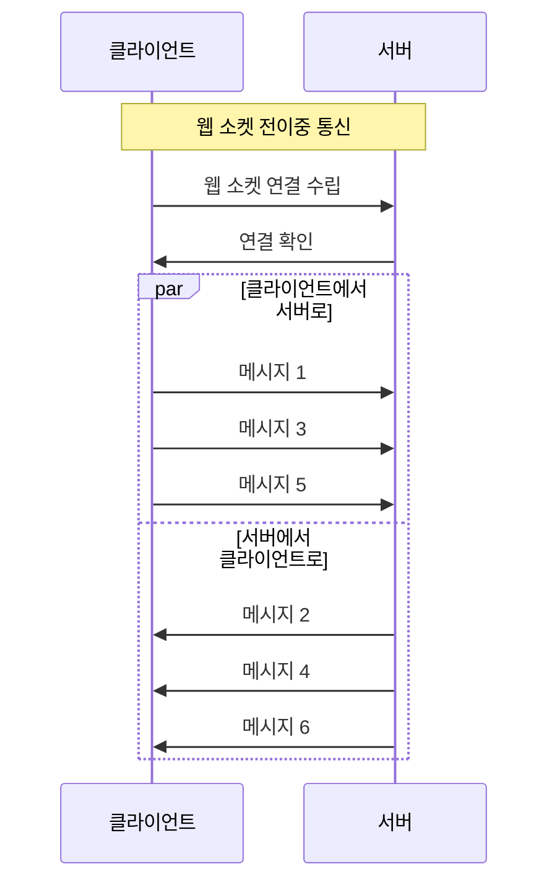
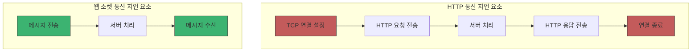
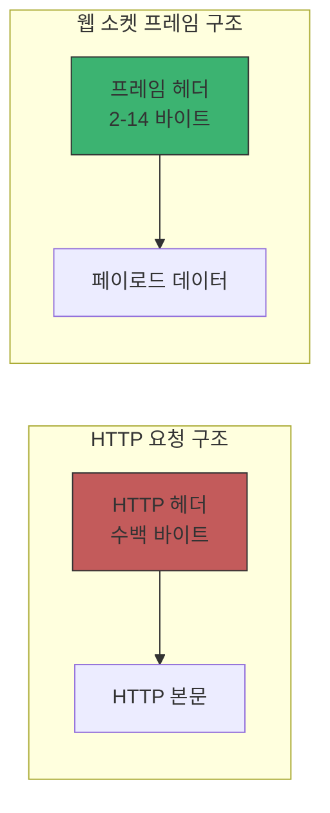
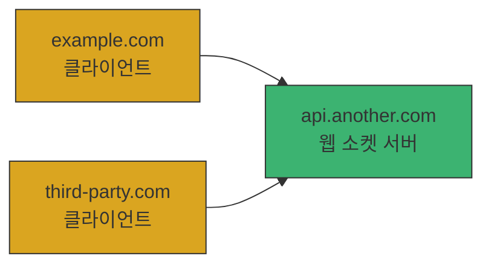

# Chapter 01 웹 소켓 소개

## 01-2 웹 소켓의 특징

### 개요
웹 소켓(WebSocket)은 기존 HTTP 통신과는 다른 여러 특징을 가지고 있어 실시간 웹 애플리케이션 개발에 적합합니다. 이 섹션에서는 웹 소켓의 주요 특징인 양방향 통신, 실시간 데이터 전송, 단일 연결 유지, 효율적인 프로토콜, 크로스 도메인 통신에 대해 자세히 알아봅니다. 이를 통해 웹 소켓이 어떻게 현대 웹 애플리케이션의 실시간 기능을 효과적으로 지원하는지 이해할 수 있습니다.

### 양방향 통신

웹 소켓의 가장 중요한 특징 중 하나는 양방향 통신(Bidirectional Communication)입니다. 이는 클라이언트와 서버가 서로 독립적으로 메시지를 주고받을 수 있음을 의미합니다.

#### 전이중 통신(Full-Duplex)

웹 소켓은 전이중 통신을 지원합니다. 이는 데이터가 동시에 양방향으로 전송될 수 있다는 의미입니다.

- **기존 HTTP**: 클라이언트가 요청을 보내고 서버가 응답하는 반이중(Half-Duplex) 방식
- **웹 소켓**: 클라이언트와 서버가 동시에 메시지를 주고받을 수 있는 전이중(Full-Duplex) 방식



#### 서버 푸시 기능

웹 소켓은 서버가 클라이언트에게 능동적으로 데이터를 전송할 수 있는 서버 푸시(Server Push) 기능을 제공합니다.

- 클라이언트의 요청 없이도 서버가 데이터를 전송할 수 있음
- 실시간 알림, 업데이트, 이벤트 전달에 이상적
- 폴링(Polling) 방식에 비해 효율적이고 즉각적인 데이터 전달 가능

### 실시간 데이터 전송

웹 소켓은 실시간 데이터 전송을 위해 설계되었으며, 지연 시간을 최소화하여 즉각적인 데이터 교환이 가능합니다.

#### 낮은 지연 시간

웹 소켓은 연결이 이미 수립되어 있기 때문에 새로운 요청을 위한 연결 설정 시간이 필요하지 않습니다.

- **HTTP 요청**: TCP 연결 설정 → HTTP 요청 전송 → 서버 처리 → HTTP 응답 전송
- **웹 소켓**: 이미 연결된 채널을 통해 즉시 메시지 전송



#### 이벤트 기반 통신

웹 소켓은 이벤트 기반 통신 모델을 사용하여 실시간 데이터 처리를 지원합니다.

- 이벤트 발생 시 즉시 데이터 전송
- 비동기 메시지 처리
- 이벤트 리스너를 통한 메시지 수신 처리

```javascript
// 웹 소켓 이벤트 기반 통신 예제
const socket = new WebSocket('ws://example.com/socket');

// 연결 이벤트
socket.addEventListener('open', (event) => {
  console.log('웹 소켓 연결이 열렸습니다.');
});

// 메시지 수신 이벤트
socket.addEventListener('message', (event) => {
  console.log('서버로부터 메시지 수신:', event.data);
});

// 오류 이벤트
socket.addEventListener('error', (error) => {
  console.error('웹 소켓 오류 발생:', error);
});

// 연결 종료 이벤트
socket.addEventListener('close', (event) => {
  console.log('웹 소켓 연결이 닫혔습니다.');
});
```

### 단일 연결 유지

웹 소켓은 한 번 연결이 수립되면 명시적으로 종료하기 전까지 단일 연결을 유지합니다.

#### 연결 수립 및 유지

웹 소켓 연결은 초기 HTTP 핸드셰이크를 통해 수립되며, 이후 지속적으로 유지됩니다.

```mermaid
sequenceDiagram
    participant Client as 클라이언트
    participant Server as 서버
    
    Client->>Server: HTTP 업그레이드 요청
    Server->>Client: 101 Switching Protocols
    
    Note over Client,Server: 웹 소켓 연결 수립 완료
    
    rect rgb(80, 80, 80)
    Note over Client,Server: 단일 연결 유지 (수 분~수 시간)
    Client->>Server: 메시지 전송
    Server->>Client: 메시지 전송
    Client->>Server: 메시지 전송
    Server->>Client: 메시지 전송
    end
    
    Client->>Server: 연결 종료 요청
    Server->>Client: 연결 종료 확인
```



#### 연결 상태 관리

웹 소켓은 연결 상태를 지속적으로 관리하며, 연결 문제 발생 시 이를 감지할 수 있습니다.

- **연결 상태 코드**: 웹 소켓 객체의 `readyState` 속성을 통해 현재 연결 상태 확인 가능
  - CONNECTING (0): 연결 중
  - OPEN (1): 연결됨
  - CLOSING (2): 연결 종료 중
  - CLOSED (3): 연결 종료됨

- **하트비트(Heartbeat)**: 연결 유지를 위한 주기적인 신호 교환
  - Ping/Pong 프레임을 통한 연결 상태 확인
  - 네트워크 장애 감지 및 연결 복구 메커니즘 지원

### 효율적인 프로토콜

웹 소켓은 최소한의 오버헤드로 데이터를 전송하는 효율적인 프로토콜입니다.

#### 최소한의 헤더

웹 소켓은 초기 핸드셰이크 이후 매우 작은 헤더만 사용하여 데이터를 전송합니다.

- **HTTP 헤더**: 일반적으로 수백 바이트의 헤더 정보
- **웹 소켓 프레임 헤더**: 2-14 바이트의 작은 헤더



#### 바이너리 데이터 지원

웹 소켓은 텍스트 데이터뿐만 아니라 바이너리 데이터도 효율적으로 전송할 수 있습니다.

- 이미지, 오디오, 비디오 등의 바이너리 데이터 직접 전송 가능
- Base64 인코딩 없이 원시 바이너리 데이터 전송으로 오버헤드 감소
- 텍스트와 바이너리 프레임 유형을 구분하여 처리

```javascript
// 바이너리 데이터 전송 예제
const socket = new WebSocket('ws://example.com/socket');

socket.addEventListener('open', () => {
  // ArrayBuffer를 사용한 바이너리 데이터 전송
  const buffer = new ArrayBuffer(4);
  const view = new Uint32Array(buffer);
  view[0] = 42;
  socket.send(buffer);

  // Blob 객체를 사용한 바이너리 데이터 전송
  const blob = new Blob(['바이너리 데이터'], {type: 'application/octet-stream'});
  socket.send(blob);
});
```

### 크로스 도메인 통신

웹 소켓은 동일 출처 정책(Same-Origin Policy)의 제약을 받지 않고 크로스 도메인 통신이 가능합니다.

#### 출처 제한 없음

웹 소켓 프로토콜은 기본적으로 크로스 도메인 연결을 허용합니다.

- 클라이언트는 다른 도메인의 웹 소켓 서버에 직접 연결 가능
- 별도의 CORS(Cross-Origin Resource Sharing) 설정 없이 통신 가능
- 서버에서 연결을 수락하는 한 어떤 도메인에서든 연결 가능



#### 보안 고려사항

크로스 도메인 통신의 편의성은 보안 위험을 수반할 수 있으므로 적절한 보안 조치가 필요합니다.

- **출처 검증**: 서버 측에서 연결 요청의 Origin 헤더를 검사하여 허용된 도메인만 접근 허용
- **인증 메커니즘**: 토큰 기반 인증, 쿠키 인증 등을 통한 접근 제어
- **메시지 검증**: 모든 수신 메시지의 유효성 검사 및 필터링

```javascript
// 서버 측 출처 검증 예제 (Node.js + ws 라이브러리)
const WebSocket = require('ws');
const server = new WebSocket.Server({ port: 8080 });

server.on('connection', (ws, req) => {
  const origin = req.headers.origin;
  
  // 허용된 출처인지 확인
  if (origin !== 'https://trusted-site.com') {
    ws.close(1003, '허용되지 않은 출처');
    return;
  }
  
  // 연결 허용 및 메시지 처리
  ws.on('message', (message) => {
    console.log('수신된 메시지:', message);
  });
});
```

### 5가지 키워드로 정리하는 핵심 포인트
1. **양방향 통신**: 웹 소켓은 클라이언트와 서버 간의 전이중(Full-Duplex) 통신을 지원하여 동시에 데이터를 주고받을 수 있으며, 서버가 클라이언트에게 능동적으로 데이터를 푸시할 수 있습니다.
2. **실시간 데이터**: 웹 소켓은 낮은 지연 시간으로 즉각적인 데이터 전송이 가능하며, 이벤트 기반 통신 모델을 통해 실시간 애플리케이션 개발에 적합합니다.
3. **단일 연결**: 한 번 수립된 웹 소켓 연결은 명시적으로 종료하기 전까지 유지되어 반복적인 연결 설정 오버헤드를 줄이고 효율적인 통신을 가능하게 합니다.
4. **효율적인 프로토콜**: 웹 소켓은 최소한의 헤더만 사용하여 데이터를 전송하고, 텍스트와 바이너리 데이터를 모두 효율적으로 처리할 수 있습니다.
5. **크로스 도메인**: 웹 소켓은 동일 출처 정책의 제약 없이 크로스 도메인 통신이 가능하지만, 이에 따른 보안 고려사항을 적절히 처리해야 합니다.

### 확인 문제
1. 웹 소켓의 통신 방식으로 올바른 것은?
   - [ ] 단방향 통신만 지원한다
   - [ ] 반이중(Half-Duplex) 통신을 지원한다
   - [ ] 전이중(Full-Duplex) 통신을 지원한다
   - [ ] 서버에서 클라이언트로만 데이터를 전송할 수 있다

2. 웹 소켓이 실시간 데이터 전송에 적합한 이유가 아닌 것은?
   - [ ] 연결이 이미 수립되어 있어 새로운 연결 설정 시간이 필요 없다
   - [ ] 최소한의 헤더만 사용하여 데이터를 전송한다
   - [ ] 이벤트 기반 통신 모델을 사용한다
   - [ ] 모든 데이터를 Base64로 인코딩하여 전송한다

3. 웹 소켓의 특징으로 올바른 것을 모두 고르세요.
   - [ ] 연결이 수립된 후 지속적으로 유지된다
   - [ ] HTTP 요청보다 더 많은 헤더 정보를 포함한다
   - [ ] 바이너리 데이터 전송을 지원한다
   - [ ] 동일 출처 정책(Same-Origin Policy)의 제약을 받지 않는다
   - [ ] 연결 상태를 관리하기 위한 메커니즘을 제공한다

> [정답 및 해설 보기](../answers_and_explanations.md#01-2-웹-소켓의-특징)
