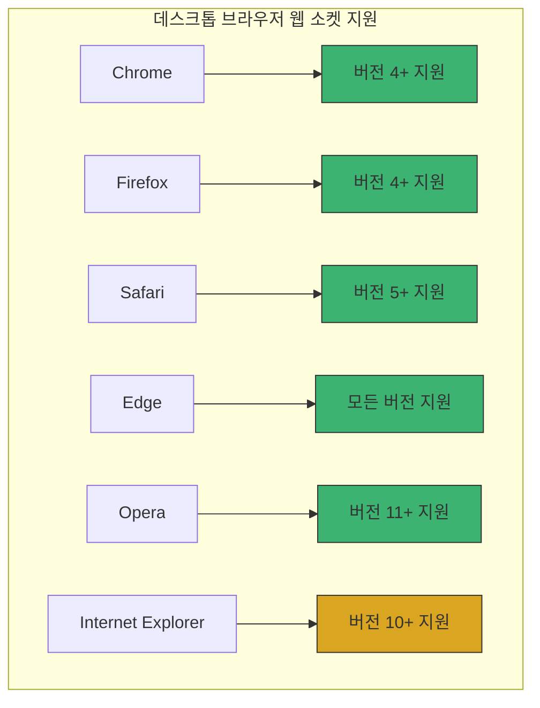
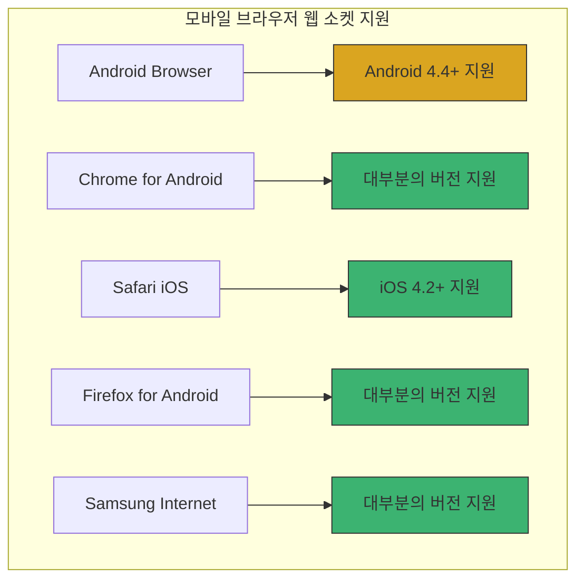
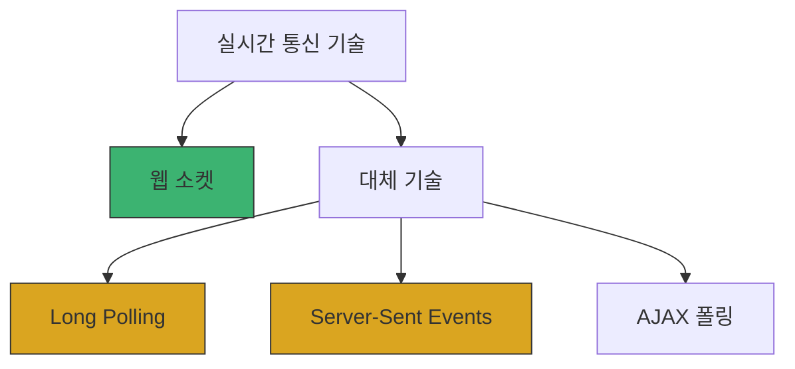

# Chapter 01 웹 소켓 소개

## 01-3 웹 소켓 지원 환경

### 개요
웹 소켓(WebSocket)은 현대 웹 애플리케이션에서 실시간 양방향 통신을 구현하는 데 중요한 기술이지만, 모든 환경에서 동일하게 지원되지는 않습니다. 이 섹션에서는 다양한 브라우저와 플랫폼에서의 웹 소켓 지원 현황, 지원되지 않는 환경을 위한 대체 방안, 그리고 웹 소켓 기능을 감지하는 방법에 대해 알아봅니다. 이를 통해 다양한 사용자 환경에서 안정적인 실시간 통신 기능을 구현할 수 있는 방법을 이해할 수 있습니다.

### 브라우저 호환성

웹 소켓은 대부분의 현대 브라우저에서 지원되지만, 브라우저의 종류와 버전에 따라 지원 범위가 다를 수 있습니다.

#### 데스크톱 브라우저

주요 데스크톱 브라우저의 웹 소켓 지원 현황은 다음과 같습니다:



주요 특징:
- **Chrome, Firefox, Safari, Edge, Opera**: 최신 버전에서 웹 소켓 프로토콜을 완벽하게 지원
- **Internet Explorer**: 버전 10부터 지원하지만 일부 제한사항 존재
  - IE 10/11에서는 일부 고급 기능이 제한될 수 있음
  - 보안 업데이트가 중단되어 사용이 권장되지 않음

#### 모바일 브라우저

모바일 환경에서의 웹 소켓 지원 현황은 다음과 같습니다:



모바일 환경 특이사항:
- **네트워크 안정성**: 모바일 환경에서는 네트워크 연결이 불안정할 수 있어 연결 끊김 처리가 중요
- **배터리 소모**: 지속적인 웹 소켓 연결은 배터리 소모를 증가시킬 수 있음
- **백그라운드 제한**: 많은 모바일 브라우저에서 앱이 백그라운드로 전환될 때 웹 소켓 연결이 제한될 수 있음

### 폴리필과 대체 방안

웹 소켓을 지원하지 않는 브라우저나 환경을 위한 다양한 대체 방안이 존재합니다.

#### 폴리필 라이브러리

웹 소켓을 직접 지원하지 않는 환경에서 유사한 기능을 제공하는 폴리필 라이브러리:

- **Socket.IO**: 가장 널리 사용되는 웹 소켓 폴리필 라이브러리
  - 웹 소켓을 기본으로 사용하되, 지원되지 않을 경우 다른 기술로 자동 폴백
  - 다양한 전송 메커니즘 지원 (WebSocket, AJAX Long Polling, Flash 등)
  - 자동 재연결, 이벤트 기반 통신 등 추가 기능 제공

```typescript
// Socket.IO 클라이언트 예제
import { Socket } from 'socket.io-client';

const socket: Socket = io('https://example.com');

socket.on('connect', () => {
  console.log('서버에 연결되었습니다.');
  
  // 메시지 전송
  socket.emit('message', '안녕하세요!');
});

socket.on('update', (data: any) => {
  console.log('서버로부터 업데이트 수신:', data);
});

socket.on('disconnect', () => {
  console.log('서버와의 연결이 끊어졌습니다.');
});
```

- **SockJS**: 다양한 브라우저를 지원하는 또 다른 웹 소켓 에뮬레이션 라이브러리
  - 웹 소켓과 동일한 API를 제공하여 쉽게 전환 가능
  - 다양한 폴백 옵션 제공

#### 대체 기술

웹 소켓을 사용할 수 없는 환경에서 실시간 통신을 구현하기 위한 대체 기술로는 다음과 같은 방법들이 있습니다:



- **Long Polling**: 클라이언트가 서버에 요청을 보내고 서버는 데이터가 있을 때까지 응답을 지연시키는 방식
- **Server-Sent Events (SSE)**: 서버에서 클라이언트로의 단방향 통신을 위한 기술
- **AJAX 폴링**: 클라이언트가 주기적으로 서버에 데이터를 요청하는 가장 기본적인 방식

### 기능 감지 방법

웹 애플리케이션에서 웹 소켓 지원 여부를 확인하고 적절한 대체 기술을 선택하는 방법을 알아봅니다.

#### 웹 소켓 지원 감지

자바스크립트를 사용하여 브라우저의 웹 소켓 지원 여부를 확인할 수 있습니다:

```typescript
// 웹 소켓 지원 여부 확인
function isWebSocketSupported(): boolean {
  return 'WebSocket' in window || 'MozWebSocket' in window;
}

if (isWebSocketSupported()) {
  console.log('이 브라우저는 웹 소켓을 지원합니다.');
  // 웹 소켓 기반 구현
  const socket: WebSocket = new WebSocket('ws://example.com/socket');
  // ...
} else {
  console.log('이 브라우저는 웹 소켓을 지원하지 않습니다.');
  // 대체 기술 사용
  setupLongPolling();
}

// setupLongPolling 함수 타입 선언
function setupLongPolling(): void {
  // Long polling 구현
}
```

#### 보안 웹 소켓(WSS) 지원 감지

보안 웹 소켓(WSS) 프로토콜 지원 여부도 확인할 수 있습니다:

```typescript
function isSecureWebSocketSupported(): boolean {
  if (!isWebSocketSupported()) return false;
  
  try {
    // 보안 웹 소켓 연결 시도
    const socket: WebSocket = new WebSocket('wss://example.com/socket');
    return true;
  } catch (e: unknown) {
    return false;
  }
}
```

#### 점진적 향상 기법

웹 소켓 지원 여부에 따라 점진적으로 기능을 향상시키는 접근 방식:

```typescript
// 통신 모듈 예제
type ConnectionType = 'websocket' | 'sse' | 'polling';

class CommunicationManager {
  private baseUrl: string;
  private connection: WebSocket | EventSource | null;
  private connectionType: ConnectionType;
  
  constructor(url: string) {
    this.baseUrl = url;
    this.connection = null;
    this.connectionType = this.detectBestConnectionMethod();
    this.connect();
  }
  
  private detectBestConnectionMethod(): ConnectionType {
    if ('WebSocket' in window) return 'websocket';
    if ('EventSource' in window) return 'sse';
    return 'polling';
  }
  
  private connect(): void {
    switch (this.connectionType) {
      case 'websocket':
        this.connection = new WebSocket(this.baseUrl.replace('http', 'ws'));
        break;
      case 'sse':
        this.connection = new EventSource(`${this.baseUrl}/events`);
        break;
      case 'polling':
        this.startPolling();
        break;
    }
    
    console.log(`연결 방식: ${this.connectionType}`);
  }
  
  private startPolling(): void {
    // 폴링 구현
  }
  
  // 나머지 구현...
}
```

### 4가지 키워드로 정리하는 핵심 포인트
1. **브라우저 호환성**: 대부분의 현대 브라우저는 웹 소켓을 지원하지만, 구형 브라우저(특히 IE 9 이하)와 일부 모바일 환경에서는 제한적이거나 지원되지 않을 수 있으므로 대상 사용자의 브라우저 환경을 고려해야 합니다.
2. **폴리필 라이브러리**: Socket.IO, SockJS와 같은 폴리필 라이브러리는 웹 소켓을 지원하지 않는 환경에서도 유사한 기능을 제공하며, 필요에 따라 자동으로 대체 기술로 전환하여 일관된 개발 경험을 제공합니다.
3. **대체 기술**: Long Polling, Server-Sent Events, AJAX 폴링과 같은 대체 기술은 웹 소켓을 사용할 수 없는 환경에서 실시간 통신을 구현하는 방법을 제공하지만, 각각 장단점이 있으므로 애플리케이션 요구사항에 맞게 선택해야 합니다.
4. **기능 감지**: 자바스크립트를 사용하여 브라우저의 웹 소켓 지원 여부를 감지하고, 지원되지 않을 경우 적절한 대체 기술로 전환하는 점진적 향상 기법을 적용하여 다양한 환경에서 일관된 사용자 경험을 제공할 수 있습니다.

### 확인 문제

1. 웹 소켓을 지원하지 않는 브라우저에서 실시간 통신을 구현하기 위한 대체 기술이 아닌 것은?
   - [ ] Long Polling
   - [ ] Server-Sent Events
   - [ ] WebRTC
   - [ ] AJAX 폴링

2. 다음 중 Socket.IO 라이브러리의 특징으로 올바른 것을 모두 고르세요.
   - [ ] 웹 소켓을 기본으로 사용하되, 지원되지 않을 경우 다른 기술로 자동 전환
   - [ ] 서버 측에서만 작동하며 클라이언트 라이브러리는 별도로 제공되지 않음
   - [ ] 자동 재연결 기능 제공
   - [ ] 이벤트 기반 통신 방식 지원
   - [ ] WebSocket API와 완전히 동일한 인터페이스 제공

3. 브라우저에서 웹 소켓 지원 여부를 확인하는 올바른 자바스크립트 코드는?
   - [ ] `if (window.WebSocket) { /* 지원 */ }`
   - [ ] `if ('WebSocket' in window) { /* 지원 */ }`
   - [ ] `if (navigator.supportsWebSocket) { /* 지원 */ }`
   - [ ] `if (document.supportsWebSocket) { /* 지원 */ }`

> [정답 및 해설 보기](../answers_and_explanations.md#01-3-웹-소켓-지원-환경)
