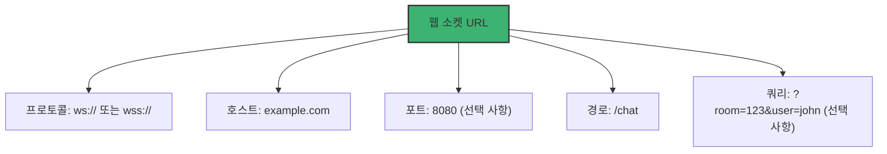
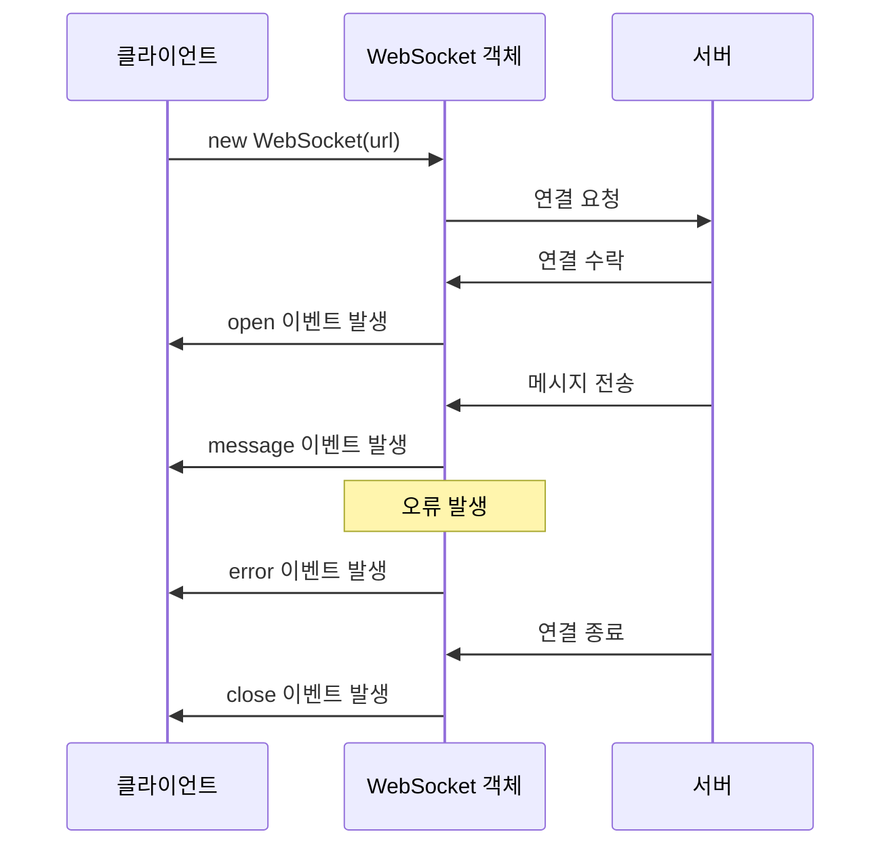
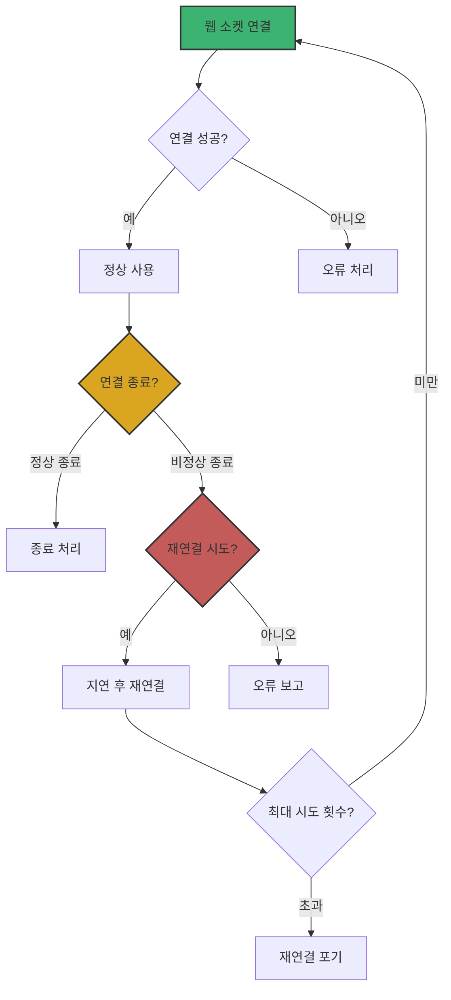

# Chapter 02 웹 소켓 기본 구현

## 02-1 웹 소켓 연결 설정

### 개요
웹 소켓 연결 설정은 클라이언트와 서버 간의 양방향 통신 채널을 구축하는 첫 단계입니다. 이 섹션에서는 웹 소켓 URL의 구조, 클라이언트 측에서 웹 소켓 연결을 설정하는 방법, 연결 상태를 관리하는 방법, 그리고 연결을 적절히 종료하는 방법에 대해 알아봅니다. 이를 통해 안정적인 웹 소켓 기반 애플리케이션을 구현하기 위한 기초를 다질 수 있습니다.

### 웹 소켓 URL 구조

웹 소켓 연결을 설정하기 위해서는 먼저 웹 소켓 URL을 이해해야 합니다. 웹 소켓 URL은 HTTP URL과 유사하지만 다른 프로토콜 식별자를 사용합니다.

#### 기본 구조

웹 소켓 URL의 기본 구조는 다음과 같습니다:

```
ws://host[:port]/path[?query]
```

보안 웹 소켓 연결(SSL/TLS를 통한)의 경우:

```
wss://host[:port]/path[?query]
```

각 구성 요소의 의미:
- **ws:// 또는 wss://** - 프로토콜 식별자 (wss는 보안 연결)
- **host** - 서버의 도메인 이름 또는 IP 주소
- **port** - (선택 사항) 서버의 포트 번호 (기본값: ws는 80, wss는 443)
- **path** - 서버의 특정 엔드포인트 경로
- **query** - (선택 사항) 추가 매개변수



#### 예시

일반 웹 소켓 연결:
```typescript
const socket: WebSocket = new WebSocket('ws://example.com/chat');
```

보안 웹 소켓 연결:
```typescript
const secureSocket: WebSocket = new WebSocket('wss://example.com/chat');
```

특정 포트와 매개변수가 있는 연결:
```typescript
const paramSocket: WebSocket = new WebSocket('wss://example.com:8080/chat?room=123&user=john');
```

#### 보안 고려사항

프로덕션 환경에서는 항상 `wss://` 프로토콜을 사용하는 것이 좋습니다. 이유는 다음과 같습니다:

1. **데이터 암호화**: 클라이언트와 서버 간의 모든 통신이 암호화됩니다.
2. **중간자 공격 방지**: 암호화된 연결은 데이터 도청이나 변조를 방지합니다.
3. **혼합 콘텐츠 문제 방지**: HTTPS 페이지에서는 보안 웹 소켓(wss://)만 사용할 수 있습니다.

### 서버 측 구현 (Java)

Java에서는 여러 방법으로 웹 소켓 서버를 구현할 수 있습니다. 가장 널리 사용되는 방법은 Spring Framework의 WebSocket 지원과 Jakarta WebSocket API(JSR-356)를 사용하는 것입니다.

#### Jakarta WebSocket API (JSR-356)

Java EE 7부터 표준화된 Jakarta WebSocket API를 사용하여 웹 소켓 서버를 구현할 수 있습니다.

```java
import jakarta.websocket.*;
import jakarta.websocket.server.ServerEndpoint;
import java.io.IOException;

@ServerEndpoint("/chat")
public class ChatEndpoint {

    @OnOpen
    public void onOpen(Session session) {
        System.out.println("새로운 연결: " + session.getId());
    }

    @OnMessage
    public void onMessage(String message, Session session) throws IOException {
        System.out.println("메시지 수신: " + message);
        // 모든 연결된 세션에 메시지 브로드캐스트
        for (Session s : session.getOpenSessions()) {
            s.getBasicRemote().sendText(message);
        }
    }

    @OnError
    public void onError(Throwable error) {
        System.err.println("오류 발생: " + error.getMessage());
    }

    @OnClose
    public void onClose(Session session, CloseReason reason) {
        System.out.println("연결 종료: " + session.getId() + ", 이유: " + reason);
    }
}
```

#### Spring WebSocket

Spring Framework는 웹 소켓을 위한 강력한 지원을 제공합니다. Spring의 `@ServerEndpoint` 또는 `WebSocketHandler` 인터페이스를 사용하여 웹 소켓 서버를 구현할 수 있습니다.

```java
import org.springframework.web.socket.CloseStatus;
import org.springframework.web.socket.TextMessage;
import org.springframework.web.socket.WebSocketSession;
import org.springframework.web.socket.handler.TextWebSocketHandler;
import java.util.concurrent.ConcurrentHashMap;

public class ChatWebSocketHandler extends TextWebSocketHandler {

    private final ConcurrentHashMap<String, WebSocketSession> sessions = new ConcurrentHashMap<>();

    @Override
    public void afterConnectionEstablished(WebSocketSession session) {
        String sessionId = session.getId();
        sessions.put(sessionId, session);
        System.out.println("새로운 연결: " + sessionId);
    }

    @Override
    protected void handleTextMessage(WebSocketSession session, TextMessage message) throws Exception {
        String payload = message.getPayload();
        System.out.println("메시지 수신: " + payload);
        
        // 모든 연결된 세션에 메시지 브로드캐스트
        TextMessage broadcastMessage = new TextMessage(payload);
        for (WebSocketSession s : sessions.values()) {
            if (s.isOpen()) {
                s.sendMessage(broadcastMessage);
            }
        }
    }

    @Override
    public void handleTransportError(WebSocketSession session, Throwable exception) {
        System.err.println("오류 발생: " + exception.getMessage());
    }

    @Override
    public void afterConnectionClosed(WebSocketSession session, CloseStatus status) {
        String sessionId = session.getId();
        sessions.remove(sessionId);
        System.out.println("연결 종료: " + sessionId + ", 상태: " + status);
    }
}
```

Spring 구성:

```java
import org.springframework.context.annotation.Bean;
import org.springframework.context.annotation.Configuration;
import org.springframework.web.socket.config.annotation.EnableWebSocket;
import org.springframework.web.socket.config.annotation.WebSocketConfigurer;
import org.springframework.web.socket.config.annotation.WebSocketHandlerRegistry;

@Configuration
@EnableWebSocket
public class WebSocketConfig implements WebSocketConfigurer {

    @Override
    public void registerWebSocketHandlers(WebSocketHandlerRegistry registry) {
        registry.addHandler(chatWebSocketHandler(), "/chat")
                .setAllowedOrigins("*"); // CORS 설정
    }

    @Bean
    public ChatWebSocketHandler chatWebSocketHandler() {
        return new ChatWebSocketHandler();
    }
}
```

### 클라이언트 측 연결 설정

#### WebSocket 생성자

TypeScript에서 웹 소켓 연결을 설정하는 가장 기본적인 방법은 `WebSocket` 생성자를 사용하는 것입니다.

```typescript
const socket: WebSocket = new WebSocket(url, [protocols]);
```

매개변수:
- **url**: 연결할 웹 소켓 서버의 URL
- **protocols**: (선택 사항) 사용할 하위 프로토콜을 지정하는 문자열 또는 문자열 배열

예시:
```typescript
// 기본 연결
const basicSocket: WebSocket = new WebSocket('wss://example.com/chat');

// 특정 프로토콜 지정
const protocolSocket: WebSocket = new WebSocket('wss://example.com/chat', 'chat-protocol');

// 여러 프로토콜 지정 (서버가 지원하는 첫 번째 프로토콜 선택)
const multiProtocolSocket: WebSocket = new WebSocket('wss://example.com/chat', ['chat-protocol', 'v2.chat-protocol']);
```

#### 이벤트 리스너 등록

웹 소켓 객체는 연결 상태 변화와 메시지 수신을 처리하기 위한 여러 이벤트를 제공합니다. 이벤트 리스너 방식을 사용하여 이러한 이벤트를 처리할 수 있습니다:

```typescript
const socket: WebSocket = new WebSocket('wss://example.com/chat');

// 연결이 열렸을 때
socket.addEventListener('open', (event: Event) => {
    console.log('웹 소켓 연결이 열렸습니다.');
    // 연결 성공 후 초기화 작업 수행
});

// 메시지를 받았을 때
socket.addEventListener('message', (event: MessageEvent) => {
    console.log('서버로부터 메시지 수신:', event.data);
    // 수신된 메시지 처리
});

// 오류가 발생했을 때
socket.addEventListener('error', (event: Event) => {
    console.error('웹 소켓 오류 발생:', event);
    // 오류 처리
});

// 연결이 닫혔을 때
socket.addEventListener('close', (event: CloseEvent) => {
    console.log(`웹 소켓 연결이 닫혔습니다. 코드: ${event.code}, 이유: ${event.reason}`);
    // 연결 종료 처리
});
```

이벤트 리스너 방식은 여러 리스너를 동일한 이벤트에 등록할 수 있고, 필요에 따라 리스너를 제거할 수 있어 더 유연합니다:

```typescript
// 이벤트 리스너 함수 정의
const handleOpen = (event: Event): void => {
    console.log('웹 소켓 연결이 열렸습니다.');
};

// 이벤트 리스너 등록
socket.addEventListener('open', handleOpen);

// 이벤트 리스너 제거
socket.removeEventListener('open', handleOpen);
```



### 연결 상태 관리

웹 소켓 연결의 현재 상태를 확인하고 관리하는 것은 안정적인 애플리케이션 구현에 중요합니다.

#### 연결 상태 확인

`WebSocket` 객체의 `readyState` 속성을 사용하여 현재 연결 상태를 확인할 수 있습니다:

```typescript
const wsConnection: WebSocket = new WebSocket('wss://example.com/chat');

// 연결 상태 확인
console.log(wsConnection.readyState);
```

`readyState` 값은 다음 상수 중 하나입니다:

- **WebSocket.CONNECTING (0)**: 연결이 설정 중입니다.
- **WebSocket.OPEN (1)**: 연결이 설정되어 통신이 가능합니다.
- **WebSocket.CLOSING (2)**: 연결이 종료 중입니다.
- **WebSocket.CLOSED (3)**: 연결이 종료되었거나 열리지 않았습니다.

예시:
```typescript
function checkSocketState(socket: WebSocket): string {
    switch(socket.readyState) {
        case WebSocket.CONNECTING:
            return '연결 중...';
        case WebSocket.OPEN:
            return '연결됨';
        case WebSocket.CLOSING:
            return '종료 중...';
        case WebSocket.CLOSED:
            return '연결 종료됨';
        default:
            return '알 수 없는 상태';
    }
}
```

#### 연결 상태에 따른 메시지 전송

메시지를 전송하기 전에 연결 상태를 확인하는 것이 좋습니다:

```typescript
function sendMessage(socket: WebSocket, message: string): boolean {
    if (socket.readyState === WebSocket.OPEN) {
        socket.send(message);
        return true;
    } else {
        console.error('웹 소켓이 열려있지 않습니다. 현재 상태:', checkSocketState(socket));
        return false;
    }
}
```

#### React에서의 연결 상태 관리 예시

React 애플리케이션에서 웹 소켓 연결 상태를 관리하는 간단한 예시 (TypeScript와 이벤트 리스너 방식 사용):

```tsx
import React, { useState, useEffect, useCallback } from 'react';

interface Message {
  content: string;
}

function WebSocketComponent(): JSX.Element {
    const [socket, setSocket] = useState<WebSocket | null>(null);
    const [isConnected, setIsConnected] = useState<boolean>(false);
    const [messages, setMessages] = useState<Message[]>([]);
    
    // 메시지 수신 핸들러
    const handleMessage = useCallback((event: MessageEvent) => {
        try {
            const message: Message = JSON.parse(event.data);
            setMessages((prevMessages) => [...prevMessages, message]);
        } catch (error) {
            console.error('메시지 파싱 오류:', error);
        }
    }, []);
    
    // 연결 열림 핸들러
    const handleOpen = useCallback(() => {
        setIsConnected(true);
        console.log('웹 소켓 연결됨');
    }, []);
    
    // 연결 종료 핸들러
    const handleClose = useCallback(() => {
        setIsConnected(false);
        console.log('웹 소켓 연결 종료됨');
    }, []);
    
    // 오류 핸들러
    const handleError = useCallback((event: Event) => {
        console.error('웹 소켓 오류:', event);
        setIsConnected(false);
    }, []);
    
    useEffect(() => {
        // 컴포넌트 마운트 시 웹 소켓 연결
        const newSocket = new WebSocket('wss://example.com/chat');
        
        // 이벤트 리스너 등록
        newSocket.addEventListener('open', handleOpen);
        newSocket.addEventListener('message', handleMessage);
        newSocket.addEventListener('close', handleClose);
        newSocket.addEventListener('error', handleError);
        
        setSocket(newSocket);
        
        // 컴포넌트 언마운트 시 웹 소켓 연결 종료 및 이벤트 리스너 제거
        return () => {
            newSocket.removeEventListener('open', handleOpen);
            newSocket.removeEventListener('message', handleMessage);
            newSocket.removeEventListener('close', handleClose);
            newSocket.removeEventListener('error', handleError);
            newSocket.close();
        };
    }, [handleOpen, handleMessage, handleClose, handleError]);
    
    const sendMessage = (content: string): void => {
        if (socket && socket.readyState === WebSocket.OPEN) {
            socket.send(JSON.stringify({ content }));
        } else {
            console.warn('메시지를 보낼 수 없습니다. 웹 소켓이 연결되어 있지 않습니다.');
        }
    };
    
    return (
        <div>
            <div>연결 상태: {isConnected ? '연결됨' : '연결되지 않음'}</div>
            <button onClick={() => sendMessage('안녕하세요!')}>메시지 전송</button>
            <ul>
                {messages.map((msg, index) => (
                    <li key={index}>{msg.content}</li>
                ))}
            </ul>
        </div>
    );
}
```

### 연결 종료 처리

웹 소켓 연결을 적절히 종료하는 것은 리소스 관리와 애플리케이션 안정성에 중요합니다.

#### 클라이언트 측 연결 종료

`WebSocket` 객체의 `close()` 메서드를 사용하여 연결을 종료할 수 있습니다:

```typescript
// 정상 종료
socket.close();

// 코드와 이유 지정
socket.close(1000, '사용자가 페이지를 떠났습니다.');

// 특정 오류로 인한 종료
socket.close(4000, '인증 토큰이 만료되었습니다.');
```

매개변수:
- **code**: (선택 사항) 연결 종료 코드 (기본값: 1000, 정상 종료)
- **reason**: (선택 사항) 연결 종료 이유를 설명하는 문자열

#### 주요 종료 코드

웹 소켓 프로토콜은 여러 표준 종료 코드를 정의합니다:

- **1000**: 정상 종료 (기본값)
- **1001**: 엔드포인트가 "떠남" (예: 서버 종료, 브라우저 페이지 이동)
- **1002**: 프로토콜 오류로 인한 종료
- **1003**: 수신할 수 없는 데이터 유형으로 인한 종료
- **1008**: 정책 위반으로 인한 종료
- **1011**: 서버에서 예상치 못한 오류 발생

사용자 정의 코드는 4000-4999 범위에서 사용할 수 있습니다.

#### 연결 종료 이벤트 처리

연결이 종료되면 `close` 이벤트가 발생합니다. 이벤트 리스너를 사용하여 이 이벤트를 처리하고 사용자에게 알리거나 재연결을 시도할 수 있습니다:

```typescript
socket.addEventListener('close', (event: CloseEvent) => {
    console.log(`연결이 종료되었습니다. 코드: ${event.code}, 이유: ${event.reason}, 정상 종료: ${event.wasClean}`);
    
    if (!event.wasClean) {
        // 비정상 종료 처리
        console.error('웹 소켓 연결이 비정상적으로 종료되었습니다.');
        // 재연결 로직 구현
    }
});
```

`CloseEvent` 객체의 주요 속성:
- **code**: 연결 종료 코드
- **reason**: 연결 종료 이유
- **wasClean**: 연결이 정상적으로 종료되었는지 여부

#### 자동 재연결 구현

연결이 예기치 않게 종료된 경우 자동으로 재연결을 시도하는 간단한 구현 (TypeScript와 이벤트 리스너 방식 사용):

```typescript
function createWebSocket(): WebSocket {
    let reconnectAttempts = 0;
    const maxReconnectAttempts = 5;
    const baseReconnectDelay = 1000; // 1초
    
    const socket: WebSocket = new WebSocket('wss://example.com/chat');
    
    // 연결 성공 핸들러
    const handleOpen = (): void => {
        console.log('웹 소켓 연결됨');
        reconnectAttempts = 0; // 연결 성공 시 재시도 횟수 초기화
    };
    
    // 연결 종료 핸들러
    const handleClose = (event: CloseEvent): void => {
        if (!event.wasClean && reconnectAttempts < maxReconnectAttempts) {
            // 지수 백오프를 사용한 재연결 지연 시간 계산
            const delay = baseReconnectDelay * Math.pow(2, reconnectAttempts);
            reconnectAttempts++;
            
            console.log(`${delay}ms 후 재연결 시도 (${reconnectAttempts}/${maxReconnectAttempts})...`);
            
            // 이벤트 리스너 제거
            socket.removeEventListener('open', handleOpen);
            socket.removeEventListener('close', handleClose);
            
            setTimeout(() => {
                createWebSocket(); // 재귀적으로 새 연결 생성
            }, delay);
        } else if (reconnectAttempts >= maxReconnectAttempts) {
            console.error('최대 재연결 시도 횟수에 도달했습니다.');
        }
    };
    
    // 이벤트 리스너 등록
    socket.addEventListener('open', handleOpen);
    socket.addEventListener('close', handleClose);
    
    return socket;
}

const wsConnection: WebSocket = createWebSocket();
```



### 5가지 키워드로 정리하는 핵심 포인트
1. **URL 구조**: 웹 소켓 URL은 `ws://` 또는 `wss://` 프로토콜을 사용하며, 보안을 위해 프로덕션 환경에서는 항상 `wss://`를 사용해야 합니다.
2. **서버 구현**: Java에서는 Jakarta WebSocket API(JSR-356)나 Spring WebSocket을 사용하여 서버 측 웹 소켓을 구현할 수 있으며, 어노테이션 기반 또는 인터페이스 기반 접근 방식을 제공합니다.
3. **이벤트 리스너**: 클라이언트에서는 `addEventListener` 메서드를 사용하여 'open', 'message', 'error', 'close' 이벤트에 대한 리스너를 등록하여 웹 소켓 생명주기의 다양한 단계를 관리합니다.
4. **상태 관리**: `readyState` 속성을 사용하여 현재 연결 상태를 확인하고, 상태에 따라 적절한 조치를 취하며, React와 같은 프레임워크에서는 상태 관리 훅과 함께 사용할 수 있습니다.
5. **종료 및 재연결**: `close()` 메서드로 연결을 명시적으로 종료하고, 비정상 종료 시 이벤트 리스너와 지수 백오프 알고리즘을 사용한 재연결 전략을 구현합니다.

### 확인 문제
1. 웹 소켓 URL에서 사용하는 프로토콜 식별자로 올바른 것은?
   - [ ] http:// 또는 https://
   - [ ] ws:// 또는 wss://
   - [ ] websocket:// 또는 websockets://
   - [ ] socket:// 또는 sockets://

2. WebSocket 객체의 readyState 값이 1일 때, 이는 어떤 상태를 의미하는가?
   - [ ] 연결 중
   - [ ] 연결됨
   - [ ] 연결 종료 중
   - [ ] 연결 종료됨

3. 웹 소켓 연결을 종료하는 코드로 올바르지 않은 것은?
   - [ ] socket.close();
   - [ ] socket.close(1000, '정상 종료');
   - [ ] socket.terminate();
   - [ ] socket.close(4000, '사용자 정의 종료 이유');

4. 웹 소켓 이벤트 핸들러에 관한 설명으로 올바른 것을 모두 고르세요.
   - [ ] onopen은 연결이 성공적으로 설정되었을 때 호출된다
   - [ ] onmessage는 서버로 메시지를 보낼 때 호출된다
   - [ ] onerror는 연결 중 오류가 발생했을 때 호출된다
   - [ ] onclose는 연결이 종료되었을 때만 호출되고, 연결 실패 시에는 호출되지 않는다
   - [ ] addEventListener 메서드를 사용하여 이벤트 핸들러를 등록할 수 있다

5. 웹 소켓 연결의 보안에 관한 설명으로 올바른 것은?
   - [ ] ws:// 프로토콜은 항상 wss:// 프로토콜보다 빠르다
   - [ ] HTTPS 페이지에서는 ws:// 프로토콜을 사용할 수 없다
   - [ ] wss:// 프로토콜은 SSL/TLS를 사용하지 않는다
   - [ ] 프로덕션 환경에서는 성능을 위해 ws:// 프로토콜을 사용하는 것이 좋다

> [정답 및 해설 보기](../answers_and_explanations.md#02-1-웹-소켓-연결-설정)
