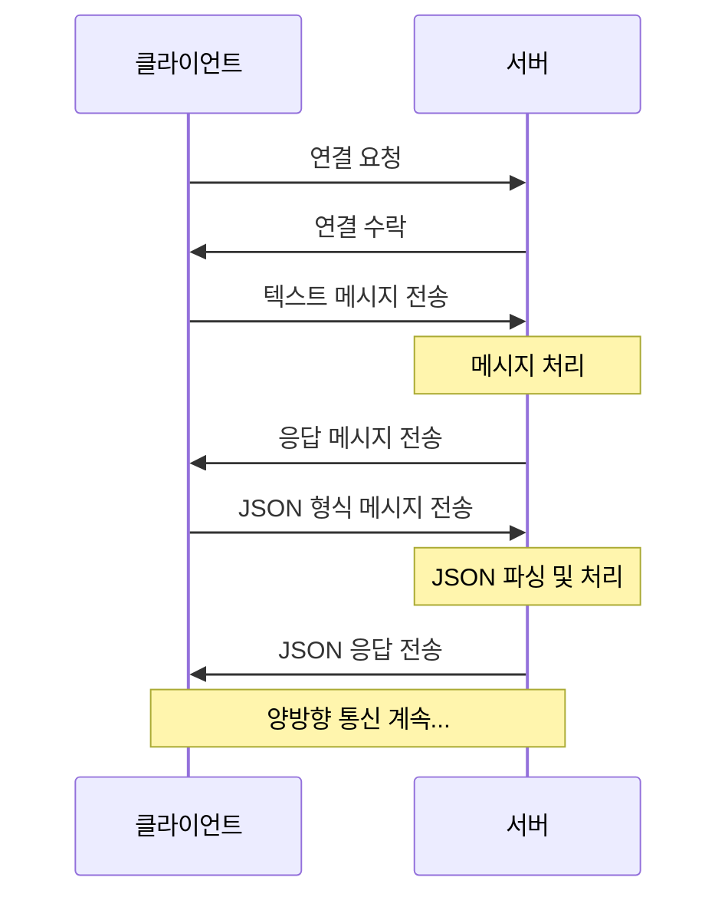
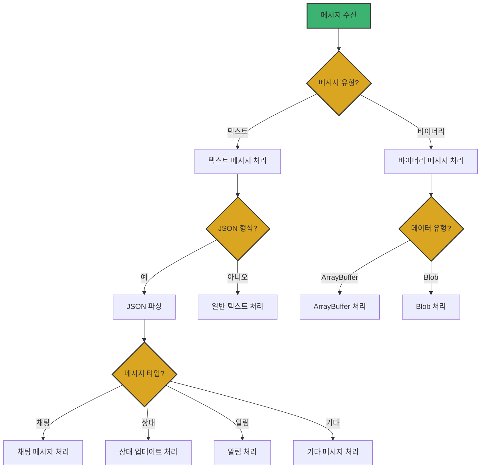

# Chapter 02 웹 소켓 기본 구현

## 02-2 메시지 송수신

### 개요
웹 소켓의 핵심 기능은 클라이언트와 서버 간의 실시간 메시지 교환입니다. 이 섹션에서는 텍스트 메시지와 바이너리 데이터를 전송하는 방법, 메시지를 수신하고 처리하는 방법, 그리고 효율적인 메시지 형식 및 직렬화 기법에 대해 알아봅니다. 이를 통해 웹 소켓을 활용한 양방향 통신 애플리케이션을 효과적으로 구현할 수 있습니다.

### 텍스트 메시지 전송

웹 소켓은 텍스트 기반 메시지를 쉽게 전송할 수 있는 방법을 제공합니다. 텍스트 메시지는 일반적으로 문자열 형태로 전송되며, JSON과 같은 형식을 사용하여 구조화된 데이터를 교환하는 데 적합합니다.

#### 클라이언트 측 텍스트 메시지 전송

클라이언트에서 서버로 텍스트 메시지를 전송하는 가장 기본적인 방법은 `WebSocket` 객체의 `send()` 메서드를 사용하는 것입니다:

```typescript
const socket: WebSocket = new WebSocket('wss://example.com/chat');

// 연결이 열린 후 메시지 전송
socket.addEventListener('open', () => {
    // 단순 문자열 전송
    socket.send('안녕하세요!');
    
    // JSON 형식의 구조화된 데이터 전송
    const message = {
        type: 'chat',
        content: '안녕하세요!',
        timestamp: new Date().toISOString()
    };
    socket.send(JSON.stringify(message));
});
```

메시지를 전송하기 전에 연결 상태를 확인하는 것이 좋습니다:

```typescript
function sendMessage(socket: WebSocket, message: string | object): boolean {
    if (socket.readyState !== WebSocket.OPEN) {
        console.error('웹 소켓이 열려있지 않습니다.');
        return false;
    }
    
    try {
        // 객체인 경우 JSON 문자열로 변환
        const data = typeof message === 'object' ? JSON.stringify(message) : message;
        socket.send(data);
        return true;
    } catch (error) {
        console.error('메시지 전송 중 오류 발생:', error);
        return false;
    }
}
```

#### 서버 측 텍스트 메시지 전송 (Java)

Java에서 Jakarta WebSocket API를 사용하여 클라이언트에 텍스트 메시지를 전송하는 방법:

```java
@ServerEndpoint("/chat")
public class ChatEndpoint {
    
    @OnOpen
    public void onOpen(Session session) {
        // 단일 클라이언트에 메시지 전송
        try {
            session.getBasicRemote().sendText("서버에 연결되었습니다!");
        } catch (IOException e) {
            e.printStackTrace();
        }
    }
    
    @OnMessage
    public void onMessage(String message, Session session) {
        // 모든 연결된 클라이언트에 메시지 브로드캐스트
        for (Session client : session.getOpenSessions()) {
            try {
                client.getBasicRemote().sendText(message);
            } catch (IOException e) {
                e.printStackTrace();
            }
        }
    }
}
```

Spring WebSocket을 사용한 예시:

```java
public class ChatWebSocketHandler extends TextWebSocketHandler {
    
    private final ConcurrentHashMap<String, WebSocketSession> sessions = new ConcurrentHashMap<>();
    
    @Override
    public void afterConnectionEstablished(WebSocketSession session) {
        String sessionId = session.getId();
        sessions.put(sessionId, session);
        
        // 단일 클라이언트에 메시지 전송
        try {
            session.sendMessage(new TextMessage("서버에 연결되었습니다!"));
        } catch (IOException e) {
            e.printStackTrace();
        }
    }
    
    @Override
    protected void handleTextMessage(WebSocketSession session, TextMessage message) {
        // 모든 클라이언트에 메시지 브로드캐스트
        for (WebSocketSession client : sessions.values()) {
            if (client.isOpen()) {
                try {
                    client.sendMessage(message);
                } catch (IOException e) {
                    e.printStackTrace();
                }
            }
        }
    }
}
```



### 바이너리 데이터 전송

텍스트 메시지 외에도 웹 소켓은 바이너리 데이터 전송을 지원합니다. 이는 이미지, 오디오, 비디오 또는 기타 바이너리 형식의 데이터를 효율적으로 전송할 때 유용합니다.

#### 클라이언트 측 바이너리 데이터 전송

클라이언트에서 바이너리 데이터를 전송하려면 `ArrayBuffer`, `Blob` 또는 `TypedArray` 객체를 `send()` 메서드에 전달합니다:

```typescript
const socket: WebSocket = new WebSocket('wss://example.com/binary');

socket.addEventListener('open', () => {
    // ArrayBuffer 전송
    const buffer = new ArrayBuffer(4);
    const view = new Uint32Array(buffer);
    view[0] = 42;
    socket.send(buffer);
    
    // Blob 전송 (예: 파일 업로드)
    const fileInput = document.querySelector('input[type="file"]') as HTMLInputElement;
    if (fileInput.files && fileInput.files.length > 0) {
        const file = fileInput.files[0];
        socket.send(file); // Blob 객체 직접 전송
    }
    
    // TypedArray 전송
    const uint8Array = new Uint8Array([1, 2, 3, 4, 5]);
    socket.send(uint8Array);
});
```

#### 서버 측 바이너리 데이터 처리 (Java)

Jakarta WebSocket API를 사용한 바이너리 데이터 처리:

```java
@ServerEndpoint("/binary")
public class BinaryEndpoint {
    
    @OnMessage
    public void onBinaryMessage(ByteBuffer buffer, Session session) {
        System.out.println("바이너리 메시지 수신: " + buffer.capacity() + " 바이트");
        
        // 바이너리 데이터 처리
        // ...
        
        // 바이너리 응답 전송
        try {
            ByteBuffer response = ByteBuffer.wrap(new byte[]{1, 2, 3, 4});
            session.getBasicRemote().sendBinary(response);
        } catch (IOException e) {
            e.printStackTrace();
        }
    }
}
```

Spring WebSocket을 사용한 바이너리 메시지 처리:

```java
public class BinaryWebSocketHandler extends BinaryWebSocketHandler {
    
    @Override
    protected void handleBinaryMessage(WebSocketSession session, BinaryMessage message) {
        ByteBuffer buffer = message.getPayload();
        System.out.println("바이너리 메시지 수신: " + buffer.capacity() + " 바이트");
        
        // 바이너리 데이터 처리
        // ...
        
        // 바이너리 응답 전송
        try {
            ByteBuffer response = ByteBuffer.wrap(new byte[]{1, 2, 3, 4});
            session.sendMessage(new BinaryMessage(response));
        } catch (IOException e) {
            e.printStackTrace();
        }
    }
}
```

#### 파일 전송 예시

웹 소켓을 통한 파일 전송 구현 예시:

```typescript
// 클라이언트 측 코드
const socket: WebSocket = new WebSocket('wss://example.com/file-transfer');
const fileInput = document.getElementById('fileInput') as HTMLInputElement;
const sendButton = document.getElementById('sendButton') as HTMLButtonElement;

sendButton.addEventListener('click', () => {
    if (fileInput.files && fileInput.files.length > 0) {
        const file = fileInput.files[0];
        
        // 파일 정보 먼저 전송
        const fileInfo = {
            type: 'file-info',
            name: file.name,
            size: file.size,
            mimeType: file.type
        };
        socket.send(JSON.stringify(fileInfo));
        
        // 파일 데이터 전송
        const reader = new FileReader();
        reader.onload = (e) => {
            if (e.target && e.target.result) {
                // 파일 내용 전송
                socket.send(e.target.result);
                console.log('파일 전송 완료');
            }
        };
        reader.readAsArrayBuffer(file);
    }
});
```

```java
// 서버 측 코드 (Jakarta WebSocket API)
@ServerEndpoint("/file-transfer")
public class FileTransferEndpoint {
    
    private String fileName;
    private long fileSize;
    private String mimeType;
    private ByteArrayOutputStream fileData;
    
    @OnMessage
    public void onTextMessage(String message, Session session) {
        try {
            // JSON 메시지 파싱
            JsonObject json = Json.createReader(new StringReader(message)).readObject();
            
            if ("file-info".equals(json.getString("type"))) {
                // 파일 정보 저장
                fileName = json.getString("name");
                fileSize = json.getJsonNumber("size").longValue();
                mimeType = json.getString("mimeType");
                
                // 파일 데이터를 저장할 스트림 초기화
                fileData = new ByteArrayOutputStream();
                
                System.out.println("파일 정보 수신: " + fileName + " (" + fileSize + " 바이트)");
            }
        } catch (Exception e) {
            e.printStackTrace();
        }
    }
    
    @OnMessage
    public void onBinaryMessage(ByteBuffer buffer, Session session) {
        try {
            // 바이너리 데이터를 파일 스트림에 추가
            byte[] bytes = new byte[buffer.remaining()];
            buffer.get(bytes);
            fileData.write(bytes);
            
            // 파일 수신 완료 확인
            if (fileData.size() >= fileSize) {
                System.out.println("파일 수신 완료: " + fileName);
                
                // 파일 저장 또는 처리
                saveFile(fileName, fileData.toByteArray());
                
                // 응답 전송
                session.getBasicRemote().sendText("{\"status\":\"success\",\"message\":\"파일 수신 완료\"}");
                
                // 리소스 정리
                fileData.close();
                fileData = null;
            }
        } catch (Exception e) {
            e.printStackTrace();
        }
    }
    
    private void saveFile(String fileName, byte[] data) {
        try {
            Path path = Paths.get("uploads", fileName);
            Files.createDirectories(path.getParent());
            Files.write(path, data);
        } catch (IOException e) {
            e.printStackTrace();
        }
    }
}
```

### 메시지 수신 처리

웹 소켓 메시지를 수신하고 처리하는 방법은 클라이언트와 서버 측에서 약간 다릅니다.

#### 클라이언트 측 메시지 수신

클라이언트에서는 `message` 이벤트를 통해 메시지를 수신합니다:

```typescript
const socket: WebSocket = new WebSocket('wss://example.com/chat');

socket.addEventListener('message', (event: MessageEvent) => {
    // 텍스트 메시지 처리
    if (typeof event.data === 'string') {
        console.log('텍스트 메시지 수신:', event.data);
        
        try {
            // JSON 메시지 파싱 시도
            const jsonData = JSON.parse(event.data);
            handleJsonMessage(jsonData);
        } catch (error) {
            // 일반 텍스트 메시지 처리
            handleTextMessage(event.data);
        }
    } 
    // 바이너리 메시지 처리
    else if (event.data instanceof ArrayBuffer) {
        console.log('ArrayBuffer 수신:', event.data);
        handleArrayBuffer(event.data);
    } 
    else if (event.data instanceof Blob) {
        console.log('Blob 수신:', event.data);
        handleBlob(event.data);
    }
});

function handleJsonMessage(data: any): void {
    // 메시지 유형에 따른 처리
    switch (data.type) {
        case 'chat':
            displayChatMessage(data.sender, data.content);
            break;
        case 'notification':
            showNotification(data.content);
            break;
        case 'status':
            updateStatus(data.status);
            break;
        default:
            console.warn('알 수 없는 메시지 유형:', data.type);
    }
}

function handleTextMessage(text: string): void {
    // 일반 텍스트 메시지 처리
    displayChatMessage('시스템', text);
}

function handleArrayBuffer(buffer: ArrayBuffer): void {
    // ArrayBuffer 처리 예시
    const view = new Uint8Array(buffer);
    console.log('첫 번째 바이트:', view[0]);
}

function handleBlob(blob: Blob): void {
    // Blob 처리 예시 (예: 이미지 표시)
    if (blob.type.startsWith('image/')) {
        const url = URL.createObjectURL(blob);
        displayImage(url);
    }
}

function displayChatMessage(sender: string, content: string): void {
    // DOM에 채팅 메시지 추가
    const chatBox = document.getElementById('chatBox');
    if (chatBox) {
        const messageElement = document.createElement('div');
        messageElement.innerHTML = `<strong>${sender}:</strong> ${content}`;
        chatBox.appendChild(messageElement);
        chatBox.scrollTop = chatBox.scrollHeight;
    }
}

function showNotification(content: string): void {
    // 알림 표시
    alert(content);
}

function updateStatus(status: string): void {
    // 상태 업데이트
    const statusElement = document.getElementById('status');
    if (statusElement) {
        statusElement.textContent = status;
    }
}

function displayImage(url: string): void {
    // 이미지 표시
    const imageContainer = document.getElementById('imageContainer');
    if (imageContainer) {
        const img = document.createElement('img');
        img.src = url;
        img.style.maxWidth = '100%';
        imageContainer.appendChild(img);
    }
}
```

#### 서버 측 메시지 수신 (Java)

서버 측에서는 어노테이션 또는 메서드 오버라이딩을 통해 메시지 수신을 처리합니다:

Jakarta WebSocket API 사용:

```java
@ServerEndpoint("/chat")
public class ChatEndpoint {
    
    @OnMessage
    public void onTextMessage(String message, Session session) {
        System.out.println("텍스트 메시지 수신: " + message);
        
        try {
            // JSON 메시지 파싱 시도
            JsonObject jsonMessage = Json.createReader(new StringReader(message)).readObject();
            handleJsonMessage(jsonMessage, session);
        } catch (Exception e) {
            // 일반 텍스트 메시지 처리
            handleTextMessage(message, session);
        }
    }
    
    @OnMessage
    public void onBinaryMessage(ByteBuffer buffer, Session session) {
        System.out.println("바이너리 메시지 수신: " + buffer.capacity() + " 바이트");
        // 바이너리 메시지 처리
    }
    
    private void handleJsonMessage(JsonObject json, Session session) throws IOException {
        String type = json.getString("type", "unknown");
        
        switch (type) {
            case "chat":
                String sender = json.getString("sender", "익명");
                String content = json.getString("content", "");
                
                // 모든 클라이언트에 메시지 브로드캐스트
                for (Session client : session.getOpenSessions()) {
                    client.getBasicRemote().sendText(message);
                }
                break;
                
            case "private":
                String recipient = json.getString("recipient", "");
                String privateContent = json.getString("content", "");
                
                // 특정 사용자에게만 메시지 전송
                for (Session client : session.getOpenSessions()) {
                    if (getUserId(client).equals(recipient)) {
                        client.getBasicRemote().sendText(message);
                        break;
                    }
                }
                break;
                
            default:
                System.out.println("알 수 없는 메시지 유형: " + type);
        }
    }
    
    private void handleTextMessage(String text, Session session) throws IOException {
        // 일반 텍스트 메시지 처리
        for (Session client : session.getOpenSessions()) {
            client.getBasicRemote().sendText(text);
        }
    }
    
    private String getUserId(Session session) {
        // 세션에서 사용자 ID 추출 (구현에 따라 다름)
        return session.getUserProperties().get("userId").toString();
    }
}
```

Spring WebSocket 사용:

```java
public class ChatWebSocketHandler extends TextWebSocketHandler {
    
    private final ConcurrentHashMap<String, WebSocketSession> sessions = new ConcurrentHashMap<>();
    private final ObjectMapper objectMapper = new ObjectMapper();
    
    @Override
    protected void handleTextMessage(WebSocketSession session, TextMessage message) throws Exception {
        String payload = message.getPayload();
        System.out.println("텍스트 메시지 수신: " + payload);
        
        try {
            // JSON 메시지 파싱 시도
            JsonNode jsonNode = objectMapper.readTree(payload);
            handleJsonMessage(jsonNode, session);
        } catch (Exception e) {
            // 일반 텍스트 메시지 처리
            handleTextMessage(payload, session);
        }
    }
    
    private void handleJsonMessage(JsonNode json, WebSocketSession session) throws IOException {
        String type = json.path("type").asText("unknown");
        
        switch (type) {
            case "chat":
                // 모든 클라이언트에 메시지 브로드캐스트
                for (WebSocketSession client : sessions.values()) {
                    if (client.isOpen()) {
                        client.sendMessage(new TextMessage(objectMapper.writeValueAsString(json)));
                    }
                }
                break;
                
            case "private":
                String recipient = json.path("recipient").asText("");
                
                // 특정 사용자에게만 메시지 전송
                for (WebSocketSession client : sessions.values()) {
                    if (getUserId(client).equals(recipient) && client.isOpen()) {
                        client.sendMessage(new TextMessage(objectMapper.writeValueAsString(json)));
                        break;
                    }
                }
                break;
                
            default:
                System.out.println("알 수 없는 메시지 유형: " + type);
        }
    }
    
    private void handleTextMessage(String text, WebSocketSession session) throws IOException {
        // 일반 텍스트 메시지 처리
        for (WebSocketSession client : sessions.values()) {
            if (client.isOpen()) {
                client.sendMessage(new TextMessage(text));
            }
        }
    }
    
    private String getUserId(WebSocketSession session) {
        // 세션에서 사용자 ID 추출 (구현에 따라 다름)
        return session.getAttributes().get("userId").toString();
    }
}
```



### 메시지 형식 및 직렬화

효율적인 웹 소켓 통신을 위해서는 적절한 메시지 형식과 직렬화 방법을 선택하는 것이 중요합니다.

#### JSON 형식

JSON은 웹 소켓 메시지에 가장 널리 사용되는 형식입니다. 이는 가독성이 좋고 다양한 언어에서 쉽게 처리할 수 있기 때문입니다.

```typescript
// 클라이언트 측 JSON 메시지 예시
const chatMessage = {
    type: 'chat',
    sender: 'user123',
    content: '안녕하세요!',
    timestamp: new Date().toISOString()
};

socket.send(JSON.stringify(chatMessage));
```

```java
// 서버 측 JSON 처리 예시 (Jakarta JSON-P 사용)
JsonObject jsonMessage = Json.createObjectBuilder()
    .add("type", "chat")
    .add("sender", "server")
    .add("content", "환영합니다!")
    .add("timestamp", Instant.now().toString())
    .build();

session.getBasicRemote().sendText(jsonMessage.toString());
```

#### 메시지 스키마 설계

효율적인 통신을 위해 일관된 메시지 스키마를 설계하는 것이 좋습니다:

```typescript
// 기본 메시지 인터페이스
interface BaseMessage {
    type: string;
    timestamp: string;
}

// 채팅 메시지
interface ChatMessage extends BaseMessage {
    type: 'chat';
    sender: string;
    content: string;
    room?: string;
}

// 상태 메시지
interface StatusMessage extends BaseMessage {
    type: 'status';
    userId: string;
    status: 'online' | 'offline' | 'away';
}

// 오류 메시지
interface ErrorMessage extends BaseMessage {
    type: 'error';
    code: number;
    message: string;
}

// 메시지 타입 유니온
type WebSocketMessage = ChatMessage | StatusMessage | ErrorMessage;

// 메시지 생성 함수
function createChatMessage(sender: string, content: string, room?: string): ChatMessage {
    return {
        type: 'chat',
        timestamp: new Date().toISOString(),
        sender,
        content,
        room
    };
}
```

#### 바이너리 직렬화

텍스트 기반 JSON 외에도 바이너리 직렬화 형식을 사용하여 메시지 크기를 줄이고 성능을 향상시킬 수 있습니다:

1. **Protocol Buffers (protobuf)**: Google에서 개발한 효율적인 바이너리 직렬화 형식
2. **MessagePack**: JSON과 유사하지만 더 작고 빠른 바이너리 형식
3. **CBOR (Concise Binary Object Representation)**: JSON 데이터 모델을 기반으로 한 바이너리 형식

MessagePack 예시:

```typescript
// 클라이언트 측 (MessagePack 사용)
import * as msgpack from 'msgpack-lite';

const socket: WebSocket = new WebSocket('wss://example.com/msgpack');

socket.addEventListener('open', () => {
    const message = {
        type: 'chat',
        sender: 'user123',
        content: '안녕하세요!',
        timestamp: new Date().toISOString()
    };
    
    // MessagePack으로 직렬화
    const encoded = msgpack.encode(message);
    socket.send(encoded);
});

socket.addEventListener('message', (event: MessageEvent) => {
    if (event.data instanceof ArrayBuffer) {
        // MessagePack 디코딩
        const decoded = msgpack.decode(new Uint8Array(event.data));
        console.log('수신된 메시지:', decoded);
    }
});
```

```java
// 서버 측 (MessagePack 사용)
@ServerEndpoint("/msgpack")
public class MsgPackEndpoint {
    
    private MessagePack msgpack = new MessagePack();
    
    @OnMessage
    public void onBinaryMessage(ByteBuffer buffer, Session session) throws IOException {
        // MessagePack 디코딩
        byte[] bytes = new byte[buffer.remaining()];
        buffer.get(bytes);
        Map<String, Object> message = msgpack.read(bytes, new ValueTypeDecoderBuilder().build());
        
        System.out.println("수신된 메시지: " + message);
        
        // 응답 생성
        Map<String, Object> response = new HashMap<>();
        response.put("type", "response");
        response.put("status", "success");
        response.put("timestamp", Instant.now().toString());
        
        // MessagePack으로 직렬화
        byte[] encoded = msgpack.write(response);
        session.getBasicRemote().sendBinary(ByteBuffer.wrap(encoded));
    }
}
```

#### 압축

대용량 메시지의 경우 압축을 사용하여 전송 크기를 줄일 수 있습니다:

```typescript
// 클라이언트 측 (pako 라이브러리 사용)
import * as pako from 'pako';

function sendCompressedMessage(socket: WebSocket, message: object): void {
    const jsonString = JSON.stringify(message);
    
    // 메시지 압축
    const compressed = pako.deflate(jsonString);
    socket.send(compressed.buffer);
}

socket.addEventListener('message', (event: MessageEvent) => {
    if (event.data instanceof ArrayBuffer) {
        try {
            // 압축 해제
            const decompressed = pako.inflate(new Uint8Array(event.data), { to: 'string' });
            const message = JSON.parse(decompressed);
            console.log('압축 해제된 메시지:', message);
        } catch (error) {
            console.error('압축 해제 오류:', error);
        }
    }
});
```

### 4가지 키워드로 정리하는 핵심 포인트
1. **메시지 전송 방식**: 웹 소켓은 `send()` 메서드를 통해 텍스트와 바이너리 데이터를 모두 전송할 수 있으며, 연결 상태를 확인한 후 전송하는 것이 중요합니다.
2. **데이터 형식**: JSON은 가장 널리 사용되는 메시지 형식이지만, 성능이 중요한 경우 MessagePack이나 Protocol Buffers와 같은 바이너리 직렬화 형식을 고려할 수 있습니다.
3. **메시지 처리**: 클라이언트는 `message` 이벤트 리스너를, 서버는 `@OnMessage` 어노테이션이나 핸들러 메서드를 통해 수신된 메시지를 처리하며, 메시지 유형에 따라 적절한 로직을 실행합니다.
4. **파일 전송**: 웹 소켓을 통해 파일을 전송할 때는 메타데이터(파일 이름, 크기 등)를 먼저 전송한 후 바이너리 데이터를 전송하는 패턴을 사용하는 것이 효과적입니다.

### 확인 문제
1. 웹 소켓에서 텍스트 메시지를 전송하는 올바른 방법은?
   - [ ] socket.transmit("Hello");
   - [ ] socket.send("Hello");
   - [ ] socket.postMessage("Hello");
   - [ ] socket.emit("message", "Hello");

2. 웹 소켓을 통해 바이너리 데이터를 전송할 때 사용할 수 있는 형식이 아닌 것은?
   - [ ] ArrayBuffer
   - [ ] Blob
   - [ ] TypedArray
   - [ ] JSON String

3. 웹 소켓 메시지 수신에 관한 설명으로 올바른 것을 모두 고르세요.
   - [ ] 클라이언트에서는 'message' 이벤트를 통해 메시지를 수신한다
   - [ ] 서버에서는 @OnMessage 어노테이션을 사용하여 메시지 핸들러를 정의할 수 있다
   - [ ] 수신된 메시지는 항상 문자열 형태이다
   - [ ] MessageEvent.data 속성은 항상 JSON 객체이다
   - [ ] 바이너리 메시지와 텍스트 메시지는 동일한 이벤트 핸들러로 처리된다

4. 웹 소켓 메시지 형식 및 직렬화에 관한 설명으로 올바른 것은?
   - [ ] JSON은 바이너리 형식이므로 항상 MessagePack보다 효율적이다
   - [ ] Protocol Buffers는 웹 소켓에서 사용할 수 없다
   - [ ] 대용량 메시지 전송 시 압축을 사용하면 전송 효율성을 높일 수 있다
   - [ ] 웹 소켓은 텍스트 메시지만 지원하므로 바이너리 직렬화는 불필요하다

> [정답 및 해설 보기](../answers_and_explanations.md#02-2-메시지-송수신)
