# Chapter 02 웹 소켓 기본 구현

## 02-3 오류 처리 및 재연결

### 개요
웹 소켓 통신에서는 네트워크 불안정, 서버 오류, 타임아웃 등 다양한 이유로 연결이 끊어질 수 있습니다. 이 섹션에서는 웹 소켓 애플리케이션에서 발생할 수 있는 일반적인 오류 유형, 오류 이벤트 처리 방법, 효과적인 재연결 전략 및 지수 백오프 알고리즘에 대해 알아봅니다. 이를 통해 더 안정적이고 사용자 친화적인 실시간 애플리케이션을 구현할 수 있습니다.

### 일반적인 오류 유형

웹 소켓 애플리케이션에서 발생할 수 있는 오류는 크게 연결 오류, 메시지 처리 오류, 프로토콜 오류로 나눌 수 있습니다.

#### 연결 오류

연결 오류는 웹 소켓 연결을 설정하거나 유지하는 과정에서 발생합니다:

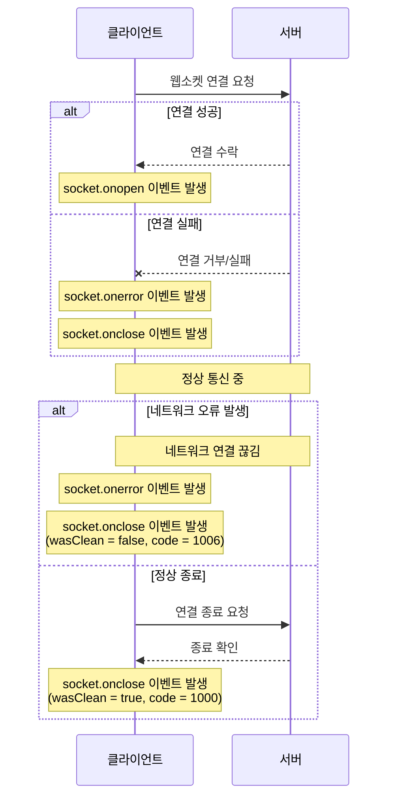

기본적인 오류 처리 코드:


주요 연결 오류 유형:

1. **연결 실패**: 서버에 연결할 수 없거나 핸드셰이크 과정에서 오류가 발생한 경우
2. **타임아웃**: 연결 설정 또는 메시지 전송 시간이 너무 오래 걸리는 경우
3. **네트워크 변경**: 사용자의 네트워크 상태가 변경되는 경우(예: Wi-Fi에서 모바일 데이터로 전환)
4. **서버 종료**: 서버가 예기치 않게 종료되거나 재시작되는 경우
5. **방화벽/프록시 문제**: 네트워크 방화벽이나 프록시가 웹 소켓 연결을 차단하는 경우

웹 소켓 연결 종료 시 사용되는 주요 상태 코드:

| 코드 | 설명 | 재연결 권장 |
|------|------|------------|
| 1000 | 정상 종료 | 필요시 |
| 1001 | 엔드포인트 종료(예: 서버 종료) | 가능 |
| 1002 | 프로토콜 오류 | 가능 |
| 1003 | 지원되지 않는 데이터 | 가능 |
| 1006 | 비정상 종료(서버 충돌 등) | 권장 |
| 1007 | 잘못된 메시지 형식 | 가능 |
| 1008 | 정책 위반 | 상황에 따라 |
| 1009 | 메시지가 너무 큼 | 가능(메시지 크기 조정 후) |
| 1011 | 서버 내부 오류 | 권장 |
| 1012 | 서버 재시작 | 권장 |
| 1013 | 일시적인 오류 | 권장 |
| 4000+ | 애플리케이션 정의 코드 | 애플리케이션 로직에 따라 |

#### 메시지 처리 오류

메시지 처리 오류는 메시지 송수신 과정에서 발생합니다:

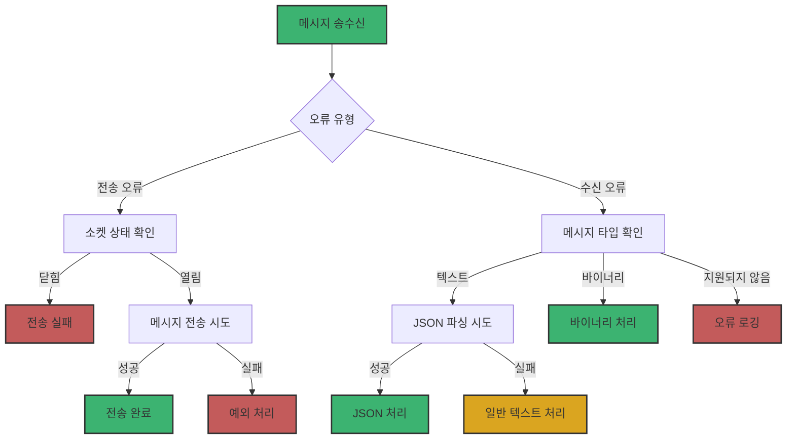

간소화된 메시지 처리 코드:


주요 메시지 처리 오류 유형:

1. **잘못된 메시지 형식**: JSON 파싱 오류 등 메시지 형식이 잘못된 경우
2. **메시지 크기 초과**: 서버나 클라이언트가 처리할 수 있는 최대 메시지 크기를 초과한 경우
3. **비즈니스 로직 오류**: 메시지 내용이 애플리케이션 로직에 맞지 않는 경우
4. **상태 불일치**: 현재 애플리케이션 상태에서 처리할 수 없는 메시지를 받은 경우

#### 프로토콜 오류

프로토콜 오류는 웹 소켓 프로토콜 자체의 문제로 발생합니다:

1. **핸드셰이크 실패**: 초기 HTTP 업그레이드 요청이 실패하는 경우
2. **프레임 형식 오류**: 웹 소켓 프레임 형식이 잘못된 경우
3. **마스킹 오류**: 클라이언트에서 서버로 전송되는 메시지의 마스킹이 잘못된 경우
4. **프래그먼트 오류**: 메시지 프래그먼트 처리 중 오류가 발생한 경우

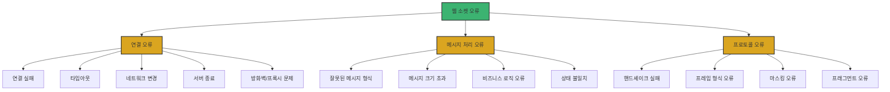

### 오류 이벤트 처리

웹 소켓 애플리케이션에서 오류를 효과적으로 처리하려면 적절한 이벤트 핸들러를 구현해야 합니다. 클라이언트와 서버 측 모두에서 오류 처리는 안정적인 애플리케이션을 위해 필수적입니다.

#### 클라이언트 측 오류 처리

클라이언트에서는 `error`와 `close` 이벤트를 통해 오류를 감지하고 처리할 수 있습니다:

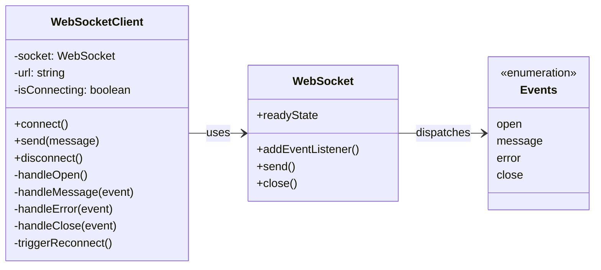

간소화된 클라이언트 오류 처리 코드:


#### 네트워크 상태 모니터링

브라우저의 `navigator.onLine` 속성과 `online`/`offline` 이벤트를 활용하여 네트워크 상태를 모니터링하고 적절히 대응할 수 있습니다:

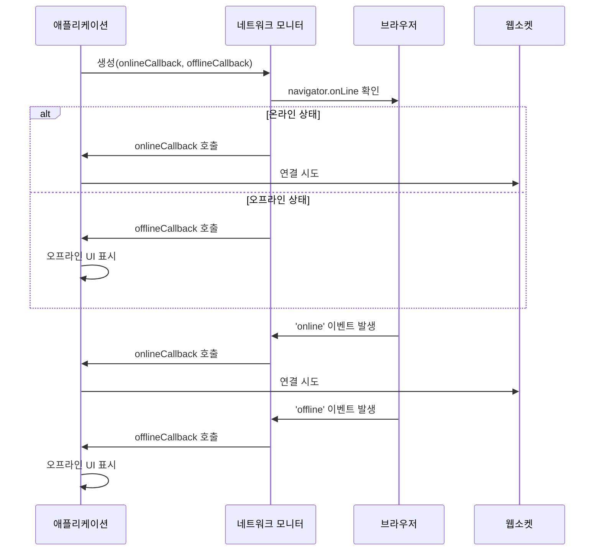

간소화된 네트워크 모니터링 코드:


#### 서버 측 오류 처리 (Java)

서버 측에서도 적절한 오류 처리가 필요합니다. 다음은 Java에서 웹 소켓 오류를 처리하는 방법을 보여줍니다:

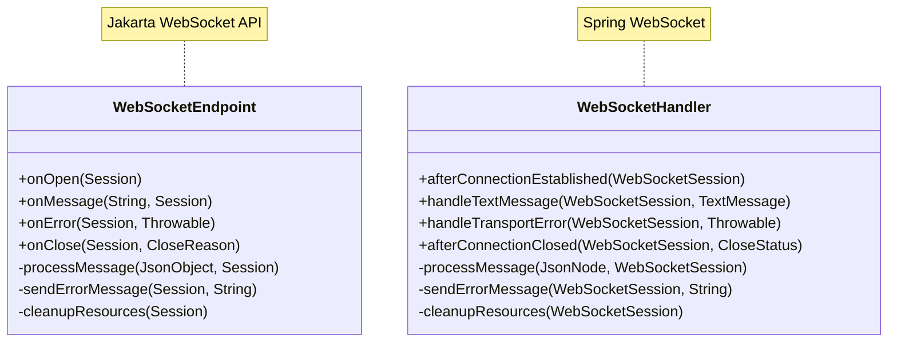

**Jakarta WebSocket API** 간소화 코드:


**Spring WebSocket** 간소화 코드:


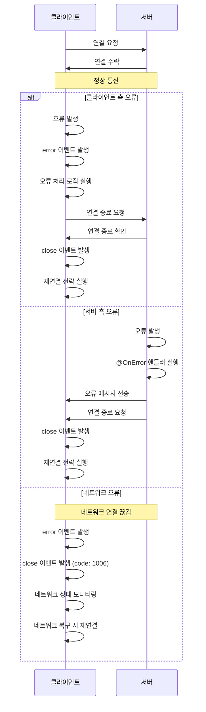

### 재연결 전략 구현

웹 소켓 연결이 끊어졌을 때 자동으로 재연결을 시도하는 것은 안정적인 실시간 애플리케이션을 위해 필수적입니다. 효과적인 재연결 전략은 사용자 경험을 크게 향상시킬 수 있습니다.

#### 기본 재연결 구현

가장 간단한 재연결 전략은 연결이 끊어지면 즉시 재연결을 시도하는 것입니다:

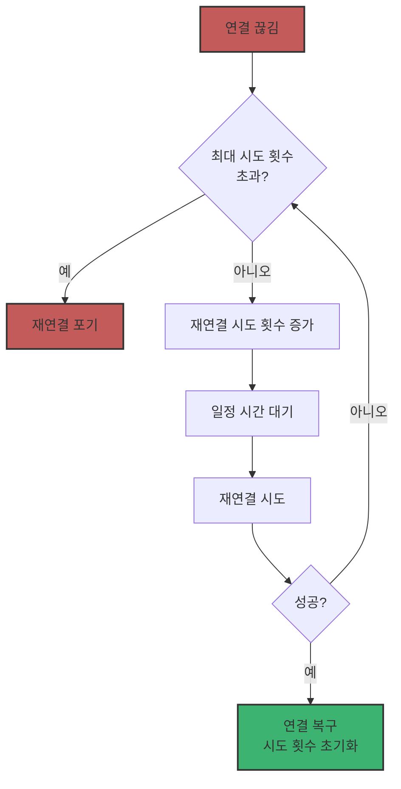

간소화된 기본 재연결 코드:


#### 지수 백오프 알고리즘

단순히 일정한 간격으로 재연결을 시도하는 것보다 지수 백오프(Exponential Backoff) 알고리즘을 사용하면 서버 부하를 줄이고 더 효율적인 재연결을 구현할 수 있습니다. 지수 백오프는 재연결 시도 간격을 점진적으로 늘려가는 방식입니다:


간소화된 지수 백오프 코드:


지수 백오프 알고리즘의 주요 특징:

1. **점진적 증가**: 재연결 간격이 시도할 때마다 증가하여 서버 부하를 줄입니다.
2. **최대 간격 제한**: 너무 긴 대기 시간을 방지하기 위해 최대 간격을 설정합니다.
3. **무작위성(지터)**: 여러 클라이언트가 동시에 재연결을 시도하는 "썬더링 허드(thundering herd)" 문제를 방지하기 위해 약간의 무작위성을 추가합니다.

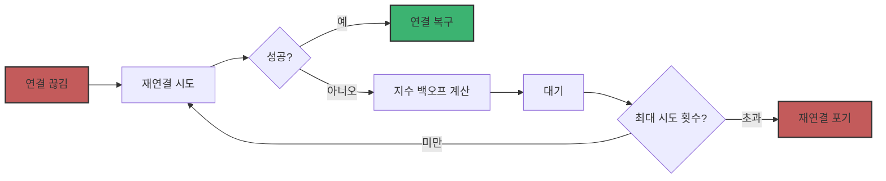

#### 완전한 재연결 구현

다음은 지수 백오프와 네트워크 상태 모니터링을 포함한 완전한 웹 소켓 클라이언트 구현의 핵심 구조입니다:

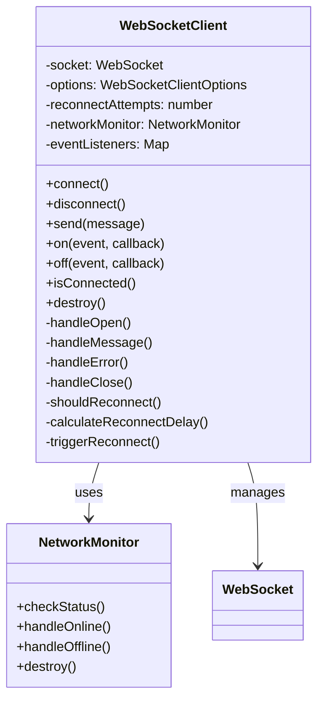

간소화된 완전한 재연결 구현 코드:


#### 서버 측 재연결 지원 (Java)

서버 측에서도 클라이언트의 재연결을 지원하기 위한 구현이 필요합니다:

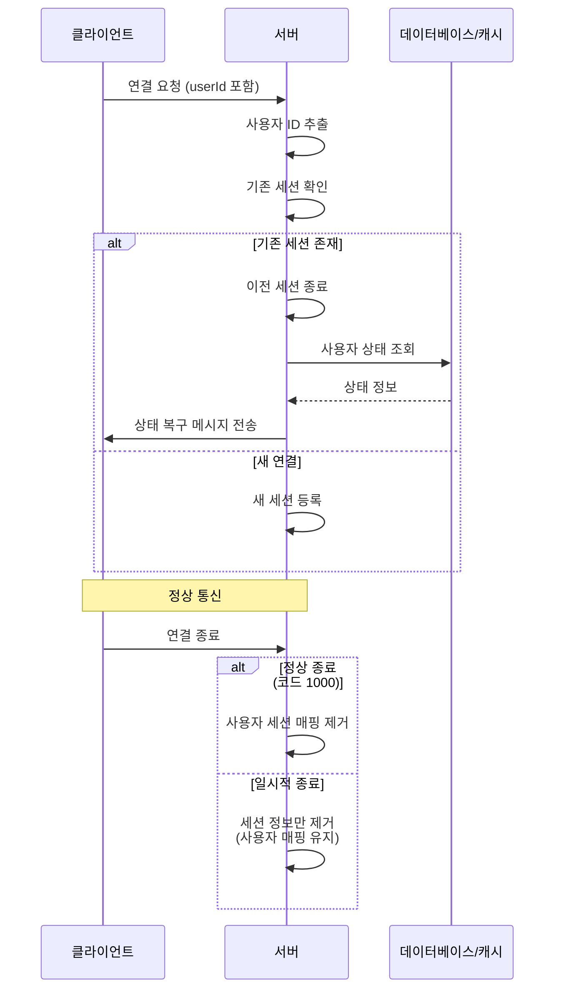

간소화된 서버 측 재연결 지원 코드:


### 4가지 키워드로 정리하는 핵심 포인트
1. **오류 유형 분류**: 웹 소켓 애플리케이션에서 발생하는 오류는 연결 오류, 메시지 처리 오류, 프로토콜 오류로 분류할 수 있으며, 각 유형에 맞는 처리 전략이 필요합니다.
2. **이벤트 기반 오류 처리**: 클라이언트에서는 `error`와 `close` 이벤트를 통해, 서버에서는 `@OnError`와 `@OnClose` 핸들러를 통해 오류를 감지하고 적절히 대응해야 합니다.
3. **지수 백오프 알고리즘**: 재연결 시도 간격을 점진적으로 늘려가는 지수 백오프 알고리즘을 사용하면 서버 부하를 줄이고 효율적인 재연결을 구현할 수 있습니다.
4. **네트워크 상태 모니터링**: 브라우저의 `navigator.onLine` 속성과 `online`/`offline` 이벤트를 활용하여 네트워크 상태를 모니터링하고 적절한 시점에 재연결을 시도하는 것이 중요합니다.

### 확인 문제
1. 웹 소켓 연결이 비정상적으로 종료되었을 때의 특징으로 올바른 것은?
   - [ ] 클라이언트에서 명시적으로 close() 메서드를 호출한 경우이다
   - [ ] CloseEvent의 wasClean 속성이 true로 설정된다
   - [ ] 서버가 정상적으로 종료 프레임을 보낸 경우이다
   - [ ] 네트워크 오류나 서버 충돌 등으로 인해 예기치 않게 연결이 끊어진 경우이다

2. 지수 백오프 알고리즘의 특징으로 올바르지 않은 것은?
   - [ ] 재연결 시도 간격이 점진적으로 증가한다
   - [ ] 서버 부하를 줄이는 데 도움이 된다
   - [ ] 무작위성(지터)을 추가하여 여러 클라이언트의 동시 재연결을 방지한다
   - [ ] 항상 일정한 간격으로 재연결을 시도한다

3. 웹 소켓 오류 처리에 관한 설명으로 올바른 것을 모두 고르세요.
   - [ ] 클라이언트에서는 error 이벤트 후에 일반적으로 close 이벤트가 발생한다
   - [ ] 서버 측에서는 @OnError 어노테이션을 사용하여 오류 핸들러를 정의할 수 있다
   - [ ] 모든 연결 종료 코드에 대해 항상 재연결을 시도해야 한다
   - [ ] 네트워크 상태 변화는 웹 소켓 연결에 영향을 미치지 않는다
   - [ ] CloseEvent의 wasClean 속성을 통해 정상 종료 여부를 확인할 수 있다

4. 다음 중 효과적인 웹 소켓 재연결 전략에 포함되어야 하는 요소는?
   - [ ] 최대 재연결 시도 횟수 제한
   - [ ] 네트워크 상태 모니터링
   - [ ] 재연결 시도 간격 조정
   - [ ] 사용자에게 재연결 상태 표시
   - [ ] 모든 항목

> [정답 및 해설 보기](../answers_and_explanations.md#02-3-오류-처리-및-재연결)
```
