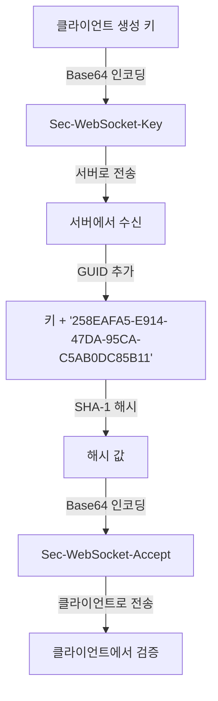
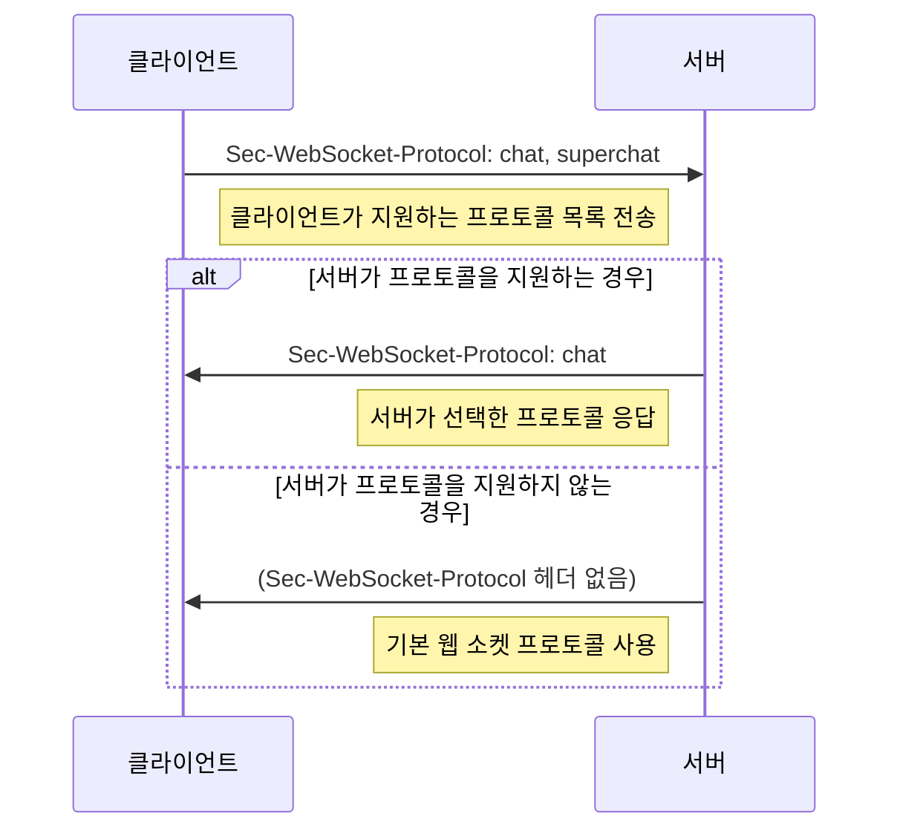

# Chapter 03 웹 소켓 프로토콜 심화

## 03-1 웹 소켓 핸드셰이크

### 개요
웹 소켓 핸드셰이크는 클라이언트와 서버 간에 웹 소켓 연결을 설정하기 위한 초기 과정입니다. 이 섹션에서는 HTTP 업그레이드 메커니즘, 핸드셰이크 요청 및 응답 헤더, WebSocket 키 및 수락 과정, 그리고 프로토콜 협상에 대해 알아봅니다. 이를 통해 웹 소켓 프로토콜의 기반이 되는 핸드셰이크 과정을 이해하고, 웹 소켓 연결이 어떻게 설정되는지 깊이 있게 파악할 수 있습니다.

### HTTP 업그레이드 메커니즘

웹 소켓 연결은 표준 HTTP 연결에서 시작하여 웹 소켓 프로토콜로 '업그레이드'하는 과정을 통해 설정됩니다. 이 메커니즘은 HTTP/1.1의 프로토콜 전환 기능을 활용합니다.

#### 업그레이드 과정

웹 소켓 핸드셰이크는 다음과 같은 단계로 진행됩니다:

1. 클라이언트가 서버에 HTTP 업그레이드 요청을 보냅니다.
2. 서버가 요청을 검증하고 업그레이드를 수락합니다.
3. HTTP 연결이 웹 소켓 프로토콜로 전환됩니다.
4. 양방향 통신 채널이 설정됩니다.

```mermaid
sequenceDiagram
    participant Client as 클라이언트
    participant Server as 서버
    
    Client->>Server: HTTP 업그레이드 요청
    Note right of Client: HTTP/1.1 101 Switching Protocols
    Server->>Client: 업그레이드 수락 응답
    Note left of Server: 연결이 웹 소켓 프로토콜로 전환됨
    
    Client<->>Server: 양방향 웹 소켓 통신
    
```

#### HTTP 업그레이드 요청 예시

클라이언트가 보내는 HTTP 업그레이드 요청의 예시입니다:

```
GET /chat HTTP/1.1
Host: server.example.com
Upgrade: websocket
Connection: Upgrade
Sec-WebSocket-Key: dGhlIHNhbXBsZSBub25jZQ==
Sec-WebSocket-Version: 13
Origin: http://example.com
```

이 요청은 일반 HTTP GET 요청처럼 보이지만, 특별한 헤더를 포함하고 있어 웹 소켓 연결로의 업그레이드를 요청합니다.

### 핸드셰이크 요청 및 응답 헤더

웹 소켓 핸드셰이크에서 사용되는 주요 헤더들을 살펴보겠습니다.

#### 요청 헤더

클라이언트가 서버에 보내는 핸드셰이크 요청에 포함되는 주요 헤더:

1. **Upgrade: websocket**
   - 클라이언트가 웹 소켓 프로토콜로 업그레이드하고자 함을 나타냅니다.

2. **Connection: Upgrade**
   - 현재 HTTP 연결을 다른 프로토콜로 업그레이드하려는 의도를 나타냅니다.

3. **Sec-WebSocket-Key**
   - 클라이언트가 생성한 무작위 키로, 서버가 웹 소켓 프로토콜을 지원하는지 확인하는 데 사용됩니다.
   - Base64로 인코딩된 16바이트 값입니다.

4. **Sec-WebSocket-Version**
   - 클라이언트가 사용하는 웹 소켓 프로토콜 버전을 지정합니다.
   - 현재 표준 버전은 13입니다.

5. **Origin** (선택 사항)
   - 요청을 시작한 페이지의 출처를 나타냅니다.
   - 크로스 오리진 보안을 위해 사용됩니다.

6. **Sec-WebSocket-Protocol** (선택 사항)
   - 클라이언트가 사용하고자 하는 하위 프로토콜을 지정합니다.
   - 쉼표로 구분된 목록으로 제공됩니다.

#### 응답 헤더

서버가 클라이언트에 보내는 핸드셰이크 응답에 포함되는 주요 헤더:

1. **HTTP/1.1 101 Switching Protocols**
   - 상태 코드 101은 프로토콜 전환이 성공했음을 나타냅니다.

2. **Upgrade: websocket**
   - 서버가 웹 소켓 프로토콜로 업그레이드함을 확인합니다.

3. **Connection: Upgrade**
   - 연결이 업그레이드되었음을 확인합니다.

4. **Sec-WebSocket-Accept**
   - 클라이언트의 Sec-WebSocket-Key에 대한 응답으로, 서버가 웹 소켓 요청을 이해하고 수락했음을 증명합니다.

5. **Sec-WebSocket-Protocol** (선택 사항)
   - 서버가 선택한 하위 프로토콜을 나타냅니다.

#### 응답 예시

서버가 보내는 핸드셰이크 응답의 예시입니다:

```
HTTP/1.1 101 Switching Protocols
Upgrade: websocket
Connection: Upgrade
Sec-WebSocket-Accept: s3pPLMBiTxaQ9kYGzzhZRbK+xOo=
```

이 응답은 웹 소켓 연결이 성공적으로 설정되었음을 나타냅니다.

### WebSocket 키 및 수락 과정

웹 소켓 핸드셰이크에서 보안을 강화하고 유효한 웹 소켓 서버와 통신하고 있는지 확인하기 위해 키 교환 과정이 사용됩니다.

#### Sec-WebSocket-Key 생성

1. 클라이언트는 16바이트의 무작위 값을 생성합니다.
2. 이 값을 Base64로 인코딩하여 `Sec-WebSocket-Key` 헤더 값으로 사용합니다.

#### Sec-WebSocket-Accept 계산

서버는 다음 단계를 통해 `Sec-WebSocket-Accept` 값을 계산합니다:

1. 클라이언트의 `Sec-WebSocket-Key` 값에 특정 GUID 문자열 `"258EAFA5-E914-47DA-95CA-C5AB0DC85B11"`을 추가합니다.
2. 결합된 문자열의 SHA-1 해시를 계산합니다.
3. 해시 값을 Base64로 인코딩합니다.



#### 예시 코드

Java에서 `Sec-WebSocket-Accept` 값을 계산하는 예시 코드:

```java
import java.security.MessageDigest;
import java.util.Base64;

public class WebSocketUtils {
    private static final String GUID = "258EAFA5-E914-47DA-95CA-C5AB0DC85B11";
    
    public static String calculateAcceptKey(String secWebSocketKey) throws Exception {
        String concatenated = secWebSocketKey + GUID;
        MessageDigest sha1 = MessageDigest.getInstance("SHA-1");
        byte[] hashBytes = sha1.digest(concatenated.getBytes("UTF-8"));
        return Base64.getEncoder().encodeToString(hashBytes);
    }
}
```

JavaScript에서 `Sec-WebSocket-Accept` 값을 계산하는 예시 코드 (Node.js 환경):

```javascript
const crypto = require('crypto');

function calculateAcceptKey(secWebSocketKey) {
    const GUID = '258EAFA5-E914-47DA-95CA-C5AB0DC85B11';
    const concatenated = secWebSocketKey + GUID;
    const sha1 = crypto.createHash('sha1').update(concatenated).digest('base64');
    return sha1;
}
```

### 프로토콜 협상

웹 소켓 핸드셰이크 과정에서 클라이언트와 서버는 사용할 하위 프로토콜(subprotocol)을 협상할 수 있습니다. 이를 통해 웹 소켓 연결 위에서 특정 메시징 프로토콜을 사용할 수 있습니다.

#### 하위 프로토콜 지정

클라이언트는 `Sec-WebSocket-Protocol` 헤더를 사용하여 지원하는 하위 프로토콜 목록을 서버에 전송합니다:

```
Sec-WebSocket-Protocol: chat, superchat, v2.chat
```

#### 서버의 프로토콜 선택

서버는 클라이언트가 제안한 프로토콜 중 하나를 선택하고, 응답 헤더에 포함시킵니다:

```
Sec-WebSocket-Protocol: chat
```

서버가 지원하는 프로토콜이 없는 경우, 이 헤더를 생략하고 기본 웹 소켓 프로토콜을 사용합니다.

#### 프로토콜 협상 과정



#### 클라이언트 측 프로토콜 지정

JavaScript에서 웹 소켓 생성 시 프로토콜을 지정하는 예시:

```javascript
// 단일 프로토콜 지정
const socket = new WebSocket('wss://example.com/chat', 'chat');

// 여러 프로토콜 지정 (서버가 지원하는 첫 번째 프로토콜 선택)
const socket = new WebSocket('wss://example.com/chat', ['chat', 'superchat']);

// 선택된 프로토콜 확인
console.log(socket.protocol); // 'chat' 또는 ''(빈 문자열, 선택된 프로토콜이 없는 경우)
```

#### 서버 측 프로토콜 처리

Java (Spring)에서 프로토콜을 처리하는 예시:

```java
@Configuration
@EnableWebSocket
public class WebSocketConfig implements WebSocketConfigurer {

    @Override
    public void registerWebSocketHandlers(WebSocketHandlerRegistry registry) {
        registry.addHandler(chatWebSocketHandler(), "/chat")
                .setAllowedOrigins("*")
                .setSubProtocols("chat", "superchat"); // 지원하는 프로토콜 지정
    }
    
    @Bean
    public WebSocketHandler chatWebSocketHandler() {
        return new ChatWebSocketHandler();
    }
}
```

### 좀 더 알아보기: 핸드셰이크 실패 처리

웹 소켓 핸드셰이크는 여러 이유로 실패할 수 있습니다. 이러한 실패를 적절히 처리하는 것이 중요합니다.

#### 일반적인 실패 원인

1. **잘못된 헤더**: 필수 헤더가 누락되거나 잘못된 형식인 경우
2. **버전 불일치**: 클라이언트와 서버가 지원하는 웹 소켓 버전이 호환되지 않는 경우
3. **서버 지원 부재**: 서버가 웹 소켓을 지원하지 않는 경우
4. **인증 실패**: 인증이 필요한 서버에서 인증에 실패한 경우
5. **프록시 문제**: 중간 프록시가 업그레이드 요청을 제대로 처리하지 못하는 경우

#### 서버 측 실패 응답

서버는 핸드셰이크 실패 시 적절한 HTTP 상태 코드로 응답해야 합니다:

- **400 Bad Request**: 잘못된 요청 형식
- **401 Unauthorized**: 인증 필요
- **403 Forbidden**: 접근 권한 없음
- **404 Not Found**: 요청한 리소스가 존재하지 않음
- **426 Upgrade Required**: 다른 프로토콜 버전 필요
- **500 Internal Server Error**: 서버 내부 오류

#### 클라이언트 측 실패 처리

JavaScript에서 핸드셰이크 실패를 처리하는 예시:

```javascript
const socket = new WebSocket('wss://example.com/chat');

// 연결 오류 처리
socket.addEventListener('error', (event) => {
    console.error('웹 소켓 연결 오류:', event);
    // 사용자에게 오류 알림
    showErrorMessage('서버에 연결할 수 없습니다. 나중에 다시 시도해 주세요.');
    
    // 대체 통신 방법으로 전환 (예: 폴링)
    fallbackToPolling();
});
```

### 5가지 키워드로 정리하는 핵심 포인트
1. **HTTP 업그레이드**: 웹 소켓 연결은 HTTP 연결에서 시작하여 'Upgrade' 및 'Connection: Upgrade' 헤더를 사용해 웹 소켓 프로토콜로 전환됩니다.
2. **핸드셰이크 헤더**: 웹 소켓 핸드셰이크는 특수 헤더(Sec-WebSocket-Key, Sec-WebSocket-Version 등)를 사용하여 클라이언트와 서버 간의 초기 통신을 설정합니다.
3. **키 교환 메커니즘**: 'Sec-WebSocket-Key'와 'Sec-WebSocket-Accept' 헤더를 통한 키 교환은 유효한 웹 소켓 서버와 통신하고 있는지 확인하는 보안 메커니즘입니다.
4. **프로토콜 협상**: 클라이언트와 서버는 'Sec-WebSocket-Protocol' 헤더를 사용하여 웹 소켓 연결 위에서 사용할 하위 프로토콜을 협상합니다.
5. **상태 코드 101**: 성공적인 웹 소켓 핸드셰이크는 'HTTP/1.1 101 Switching Protocols' 응답으로 표시되며, 이후 양방향 통신이 가능해집니다.

### 확인 문제
1. 웹 소켓 핸드셰이크에서 클라이언트가 보내는 필수 헤더가 아닌 것은?
   - [ ] Upgrade: websocket
   - [ ] Connection: Upgrade
   - [ ] Sec-WebSocket-Key
   - [ ] Content-Length

2. 웹 소켓 핸드셰이크 성공 시 서버가 응답하는 HTTP 상태 코드는?
   - [ ] 200 OK
   - [ ] 101 Switching Protocols
   - [ ] 204 No Content
   - [ ] 301 Moved Permanently

3. Sec-WebSocket-Accept 값을 계산하는 방법으로 올바른 것은?
   - [ ] Sec-WebSocket-Key 값을 Base64로 다시 인코딩한다
   - [ ] Sec-WebSocket-Key 값에 특정 GUID를 추가하고 SHA-1 해시를 계산한 후 Base64로 인코딩한다
   - [ ] Sec-WebSocket-Key 값을 SHA-256으로 해시한다
   - [ ] Sec-WebSocket-Key 값을 그대로 사용한다

4. 웹 소켓 프로토콜 협상에 관한 설명으로 올바른 것을 모두 고르세요.
   - [ ] 클라이언트는 Sec-WebSocket-Protocol 헤더를 사용하여 지원하는 프로토콜을 서버에 알린다
   - [ ] 서버는 반드시 클라이언트가 제안한 프로토콜 중 하나를 선택해야 한다
   - [ ] 프로토콜 협상이 실패하면 웹 소켓 연결도 항상 실패한다
   - [ ] 서버가 프로토콜을 선택하면 응답에 Sec-WebSocket-Protocol 헤더를 포함시킨다
   - [ ] 프로토콜 협상은 웹 소켓 연결 설정 후에 이루어진다

5. 웹 소켓 핸드셰이크 과정에서 발생할 수 있는 오류 상황으로 올바른 것은?
   - [ ] 클라이언트가 지원하지 않는 웹 소켓 버전을 요청한 경우
   - [ ] 서버가 웹 소켓 프로토콜을 지원하지 않는 경우
   - [ ] 중간 프록시가 업그레이드 요청을 차단한 경우
   - [ ] Sec-WebSocket-Key 헤더가 누락된 경우

> [정답 및 해설 보기](../answers_and_explanations.md#03-1-웹-소켓-핸드셰이크)
