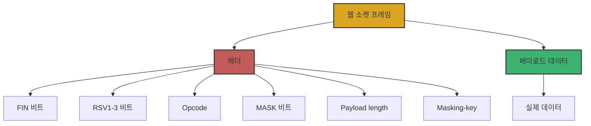
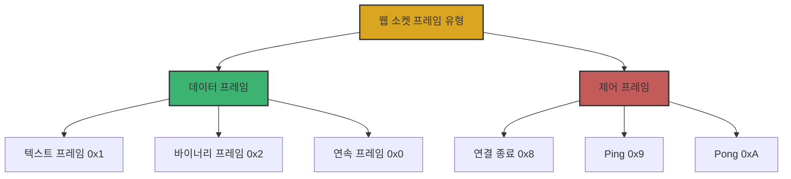
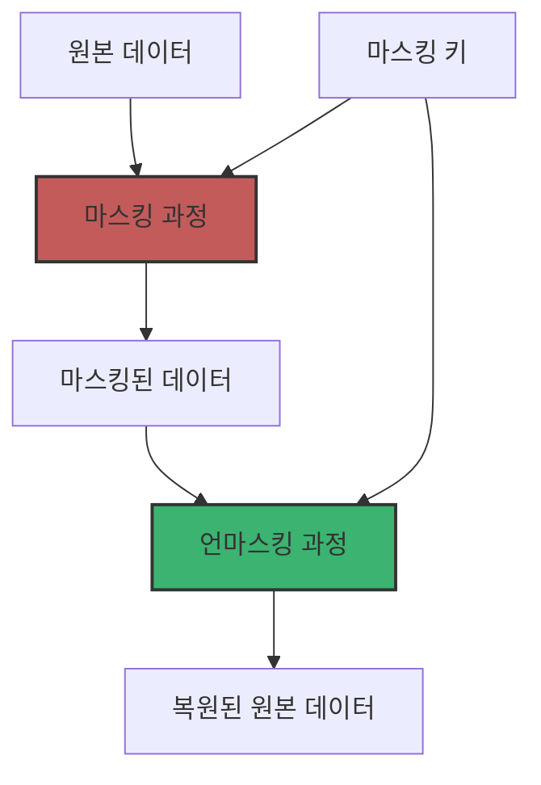
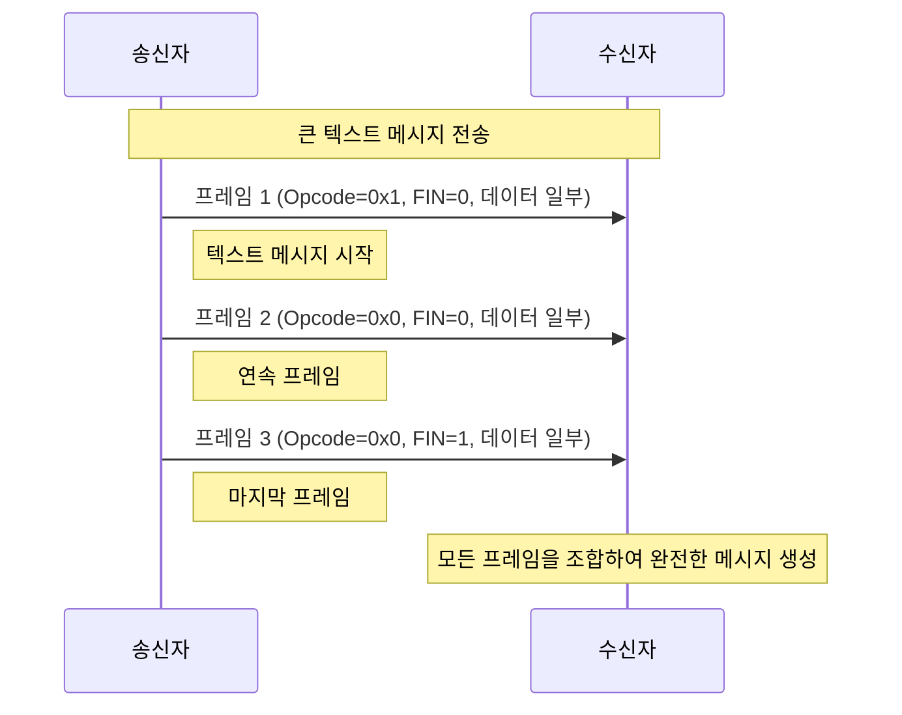

# Chapter 03 웹 소켓 프로토콜 심화

## 03-2 프레임 구조 및 제어

### 개요
웹 소켓 프로토콜은 데이터를 프레임(frame)이라는 작은 단위로 나누어 전송합니다. 이 섹션에서는 웹 소켓 프레임의 구조, 다양한 프레임 유형, 마스킹 메커니즘, 그리고 프래그먼트화와 메시지 조합 방법에 대해 알아봅니다. 이를 통해 웹 소켓 프로토콜의 내부 작동 방식을 이해하고, 효율적인 웹 소켓 애플리케이션을 개발하는 데 필요한 지식을 얻을 수 있습니다.

### 웹 소켓 프레임 형식

웹 소켓 프로토콜은 바이너리 프레임 형식을 사용하여 데이터를 전송합니다. 각 프레임은 헤더와 페이로드(데이터)로 구성됩니다.

#### 프레임 구조

웹 소켓 프레임의 기본 구조는 다음과 같습니다:

```
 0                   1                   2                   3
 0 1 2 3 4 5 6 7 8 9 0 1 2 3 4 5 6 7 8 9 0 1 2 3 4 5 6 7 8 9 0 1
+-+-+-+-+-------+-+-------------+-------------------------------+
|F|R|R|R| opcode|M| Payload len |    Extended payload length    |
|I|S|S|S|  (4)  |A|     (7)     |             (16/64)           |
|N|V|V|V|       |S|             |   (if payload len==126/127)   |
| |1|2|3|       |K|             |                               |
+-+-+-+-+-------+-+-------------+ - - - - - - - - - - - - - - - +
|     Extended payload length continued, if payload len == 127  |
+ - - - - - - - - - - - - - - - +-------------------------------+
|                               |Masking-key, if MASK set to 1  |
+-------------------------------+-------------------------------+
| Masking-key (continued)       |          Payload Data         |
+-------------------------------- - - - - - - - - - - - - - - - +
:                     Payload Data continued ...                :
+ - - - - - - - - - - - - - - - - - - - - - - - - - - - - - - - +
|                     Payload Data continued ...                |
+---------------------------------------------------------------+
```

프레임 헤더의 주요 구성 요소:

1. **FIN (1비트)**: 현재 프레임이 메시지의 마지막 프레임인지 나타냅니다.
   - 0: 메시지의 중간 프레임
   - 1: 메시지의 마지막 프레임

2. **RSV1, RSV2, RSV3 (각 1비트)**: 확장을 위해 예약된 비트입니다. 기본적으로 0이며, 확장이 협상된 경우에만 사용됩니다.

3. **Opcode (4비트)**: 프레임의 유형을 나타냅니다.
   - 0x0: 연속 프레임
   - 0x1: 텍스트 프레임
   - 0x2: 바이너리 프레임
   - 0x8: 연결 종료
   - 0x9: Ping
   - 0xA: Pong
   - 기타: 예약됨

4. **MASK (1비트)**: 페이로드 데이터가 마스킹되었는지 여부를 나타냅니다.
   - 클라이언트에서 서버로 보내는 모든 프레임은 반드시 마스킹되어야 합니다(1).
   - 서버에서 클라이언트로 보내는 프레임은 마스킹되지 않아야 합니다(0).

5. **Payload length (7비트 + 확장)**: 페이로드 데이터의 길이를 나타냅니다.
   - 0-125: 실제 페이로드 길이
   - 126: 다음 2바이트가 16비트 무부호 정수로 페이로드 길이를 나타냄
   - 127: 다음 8바이트가 64비트 무부호 정수로 페이로드 길이를 나타냄

6. **Masking-key (0 또는 4바이트)**: MASK가 1인 경우, 페이로드 데이터를 마스킹하는 데 사용되는 4바이트 키입니다.

7. **Payload Data**: 실제 전송되는 데이터입니다.



### 프레임 유형 (텍스트, 바이너리, 제어)

웹 소켓 프로토콜은 다양한 유형의 프레임을 지원하며, 이는 Opcode 필드로 구분됩니다. 프레임 유형은 크게 데이터 프레임과 제어 프레임으로 나눌 수 있습니다.

#### 데이터 프레임

데이터 프레임은 실제 애플리케이션 데이터를 전송하는 데 사용됩니다:

1. **텍스트 프레임 (Opcode: 0x1)**
   - UTF-8 인코딩된 텍스트 데이터를 전송합니다.
   - 웹 애플리케이션에서 가장 일반적으로 사용되는 형식입니다.
   - JSON 데이터 전송에 적합합니다.

2. **바이너리 프레임 (Opcode: 0x2)**
   - 이미지, 오디오, 비디오 등의 바이너리 데이터를 전송합니다.
   - 인코딩 없이 원시 바이너리 데이터를 그대로 전송할 수 있습니다.

3. **연속 프레임 (Opcode: 0x0)**
   - 이전 프레임의 연속임을 나타냅니다.
   - 큰 메시지를 여러 프레임으로 나누어 전송할 때 사용됩니다.

#### 제어 프레임

제어 프레임은 연결 관리 및 상태 확인에 사용됩니다:

1. **연결 종료 프레임 (Opcode: 0x8)**
   - 웹 소켓 연결을 정상적으로 종료하기 위해 사용됩니다.
   - 선택적으로 종료 이유를 포함할 수 있습니다.

2. **Ping 프레임 (Opcode: 0x9)**
   - 연결이 여전히 활성 상태인지 확인하기 위해 사용됩니다.
   - 수신자는 반드시 Pong 프레임으로 응답해야 합니다.

3. **Pong 프레임 (Opcode: 0xA)**
   - Ping 프레임에 대한 응답으로 사용됩니다.
   - 연결이 여전히 활성 상태임을 확인합니다.



#### 제어 프레임 특징

제어 프레임에는 몇 가지 중요한 제약이 있습니다:

1. 제어 프레임은 프래그먼트화될 수 없습니다(FIN 비트는 항상 1).
2. 제어 프레임의 페이로드 길이는 125바이트를 초과할 수 없습니다.
3. 제어 프레임은 다른 프레임의 전송 중간에도 삽입될 수 있습니다.

### 마스킹 메커니즘

웹 소켓 프로토콜에서 마스킹은 클라이언트에서 서버로 전송되는 모든 프레임에 적용되는 중요한 보안 메커니즘입니다.

#### 마스킹의 목적

마스킹의 주요 목적은 캐시 포이즈닝(cache poisoning)과 같은 프록시 기반 공격을 방지하는 것입니다. 이는 악의적인 클라이언트가 특정 패턴의 데이터를 전송하여 프록시 서버를 혼란시키는 것을 방지합니다.

#### 마스킹 과정

마스킹 과정은 다음과 같이 진행됩니다:

1. 클라이언트는 4바이트 마스킹 키를 무작위로 생성합니다.
2. 이 키는 프레임 헤더의 Masking-key 필드에 포함됩니다.
3. 페이로드 데이터의 각 바이트는 다음 공식에 따라 마스킹됩니다:
   ```
   마스킹된 바이트[i] = 원본 바이트[i] XOR 마스킹 키[i % 4]
   ```
4. 서버는 동일한 과정을 역으로 적용하여 원본 데이터를 복원합니다.



#### 마스킹 예시 코드

JavaScript에서 마스킹을 구현하는 예시 코드:

```javascript
function maskData(data, maskingKey) {
    const maskedData = new Uint8Array(data.length);
    for (let i = 0; i < data.length; i++) {
        maskedData[i] = data[i] ^ maskingKey[i % 4];
    }
    return maskedData;
}

function unmaskData(maskedData, maskingKey) {
    // XOR 연산은 양방향이므로 마스킹과 언마스킹에 동일한 함수 사용 가능
    return maskData(maskedData, maskingKey);
}
```

Java에서 마스킹을 구현하는 예시 코드:

```java
public byte[] maskData(byte[] data, byte[] maskingKey) {
    byte[] maskedData = new byte[data.length];
    for (int i = 0; i < data.length; i++) {
        maskedData[i] = (byte) (data[i] ^ maskingKey[i % 4]);
    }
    return maskedData;
}

public byte[] unmaskData(byte[] maskedData, byte[] maskingKey) {
    // XOR 연산은 양방향이므로 마스킹과 언마스킹에 동일한 함수 사용 가능
    return maskData(maskedData, maskingKey);
}
```

#### 마스킹 규칙

웹 소켓 프로토콜에서 마스킹에 관한 중요한 규칙:

1. 클라이언트에서 서버로 전송되는 모든 프레임은 반드시 마스킹되어야 합니다.
2. 서버에서 클라이언트로 전송되는 프레임은 마스킹되지 않아야 합니다.
3. 서버가 마스킹되지 않은 프레임을 클라이언트로부터 받으면, 연결을 즉시 종료해야 합니다.
4. 클라이언트가 마스킹된 프레임을 서버로부터 받으면, 연결을 즉시 종료해야 합니다.

### 프래그먼트화 및 메시지 조합

웹 소켓 프로토콜은 큰 메시지를 여러 프레임으로 나누어 전송하는 프래그먼트화(fragmentation) 기능을 제공합니다. 이는 대용량 데이터를 효율적으로 전송하고 메모리 사용을 최적화하는 데 도움이 됩니다.

#### 프래그먼트화 과정

프래그먼트화는 다음과 같은 과정으로 이루어집니다:

1. 첫 번째 프레임은 메시지 유형(텍스트 또는 바이너리)을 나타내는 Opcode와 FIN=0을 가집니다.
2. 중간 프레임들은 Opcode=0(연속 프레임)과 FIN=0을 가집니다.
3. 마지막 프레임은 Opcode=0과 FIN=1을 가집니다.



#### 메시지 조합

수신자는 다음 단계를 통해 프래그먼트화된 메시지를 조합합니다:

1. 첫 번째 프레임(FIN=0, Opcode≠0)을 받으면 메시지 버퍼를 초기화합니다.
2. 각 프레임의 페이로드 데이터를 버퍼에 추가합니다.
3. 마지막 프레임(FIN=1)을 받으면 버퍼의 모든 데이터를 조합하여 완전한 메시지를 생성합니다.

#### 프래그먼트화 예시 코드

JavaScript에서 프래그먼트화된 메시지를 처리하는 예시 코드:

```javascript
class WebSocketMessageAssembler {
    constructor() {
        this.reset();
    }
    
    reset() {
        this.messageType = null;  // 'text' 또는 'binary'
        this.fragments = [];
        this.inProgress = false;
    }
    
    addFragment(frame) {
        const { fin, opcode, payload } = frame;
        
        if (!this.inProgress) {
            // 새 메시지 시작
            if (opcode === 0x1) {
                this.messageType = 'text';
            } else if (opcode === 0x2) {
                this.messageType = 'binary';
            } else {
                throw new Error('Invalid first frame opcode');
            }
            this.inProgress = true;
        } else if (opcode !== 0x0) {
            // 연속 프레임은 opcode가 0이어야 함
            throw new Error('Continuation frame must have opcode 0');
        }
        
        this.fragments.push(payload);
        
        if (fin) {
            // 메시지 완성
            const completeMessage = this.assembleMessage();
            this.reset();
            return { type: this.messageType, data: completeMessage };
        }
        
        return null;  // 아직 메시지가 완성되지 않음
    }
    
    assembleMessage() {
        if (this.messageType === 'text') {
            // 텍스트 메시지 조합
            return this.fragments.map(f => new TextDecoder().decode(f)).join('');
        } else {
            // 바이너리 메시지 조합
            const totalLength = this.fragments.reduce((sum, f) => sum + f.length, 0);
            const result = new Uint8Array(totalLength);
            let offset = 0;
            
            for (const fragment of this.fragments) {
                result.set(fragment, offset);
                offset += fragment.length;
            }
            
            return result;
        }
    }
}
```

#### 프래그먼트화의 이점

프래그먼트화는 다음과 같은 이점을 제공합니다:

1. **메모리 효율성**: 전체 메시지를 한 번에 메모리에 로드할 필요가 없습니다.
2. **스트리밍 처리**: 메시지의 일부가 도착하는 즉시 처리를 시작할 수 있습니다.
3. **우선순위 제어**: 중요한 제어 프레임(예: Ping)을 큰 메시지 전송 중에도 삽입할 수 있습니다.
4. **대용량 데이터 전송**: 메모리 제한 없이 대용량 데이터를 전송할 수 있습니다.

### 좀 더 알아보기: 제어 프레임 처리

웹 소켓 애플리케이션에서 제어 프레임을 적절히 처리하는 것은 안정적인 연결 유지를 위해 중요합니다.

#### 연결 종료 프레임 처리

연결 종료 프레임(Opcode: 0x8)은 정상적인 연결 종료를 위해 사용됩니다:

1. 연결을 종료하려는 측에서 상태 코드와 이유를 포함한 연결 종료 프레임을 전송합니다.
2. 수신 측은 동일한 상태 코드와 이유로 응답 연결 종료 프레임을 전송합니다.
3. 응답을 보낸 후 연결을 종료합니다.

```javascript
// 연결 종료 프레임 전송 예시
function sendCloseFrame(socket, code = 1000, reason = '') {
    const encoder = new TextEncoder();
    const reasonBytes = encoder.encode(reason);
    const data = new Uint8Array(2 + reasonBytes.length);
    
    // 상태 코드 (2바이트)
    data[0] = (code >> 8) & 0xFF;
    data[1] = code & 0xFF;
    
    // 이유 (UTF-8 인코딩)
    data.set(reasonBytes, 2);
    
    // 연결 종료 프레임 전송
    socket.send(data);
}
```

#### Ping/Pong 프레임 처리

Ping과 Pong 프레임은 연결 상태를 확인하고 유지하는 데 사용됩니다:

1. Ping 프레임(Opcode: 0x9)을 받으면 즉시 동일한 페이로드로 Pong 프레임(Opcode: 0xA)을 응답해야 합니다.
2. 애플리케이션은 주기적으로 Ping 프레임을 전송하여 연결이 여전히 활성 상태인지 확인할 수 있습니다.

```javascript
// Ping 프레임 처리 예시
socket.addEventListener('message', (event) => {
    const data = new Uint8Array(event.data);
    
    // 프레임 헤더 파싱 (간소화된 예시)
    const opcode = data[0] & 0x0F;
    
    if (opcode === 0x9) {  // Ping 프레임
        // 동일한 페이로드로 Pong 응답
        const pongFrame = createPongFrame(data.slice(headerSize));
        socket.send(pongFrame);
    }
});
```

### 5가지 키워드로 정리하는 핵심 포인트
1. **프레임 구조**: 웹 소켓 프레임은 FIN, RSV, Opcode, MASK, Payload length 등의 필드로 구성된 헤더와 실제 데이터를 포함하는 페이로드로 이루어져 있습니다.
2. **프레임 유형**: 웹 소켓은 텍스트(0x1), 바이너리(0x2), 연속(0x0) 등의 데이터 프레임과 연결 종료(0x8), Ping(0x9), Pong(0xA) 등의 제어 프레임을 지원합니다.
3. **마스킹 메커니즘**: 클라이언트에서 서버로 전송되는 모든 프레임은 보안을 위해 4바이트 마스킹 키를 사용하여 XOR 연산으로 마스킹되어야 합니다.
4. **프래그먼트화**: 큰 메시지는 여러 프레임으로 나누어 전송할 수 있으며, 첫 프레임은 메시지 유형을 나타내고 마지막 프레임은 FIN 비트가 1로 설정됩니다.
5. **제어 프레임**: 연결 종료, Ping, Pong 등의 제어 프레임은 연결 관리와 상태 확인에 사용되며, 125바이트 이하의 페이로드만 가질 수 있고 프래그먼트화될 수 없습니다.

### 확인 문제
1. 웹 소켓 프레임 헤더에서 FIN 비트의 역할은 무엇인가요?
   - [ ] 프레임이 마스킹되었는지 여부를 나타낸다
   - [ ] 프레임이 메시지의 마지막 프레임인지 여부를 나타낸다
   - [ ] 프레임이 텍스트인지 바이너리인지 나타낸다
   - [ ] 프레임이 제어 프레임인지 여부를 나타낸다

2. 웹 소켓 프로토콜에서 마스킹에 관한 설명으로 올바른 것은?
   - [ ] 모든 웹 소켓 프레임은 항상 마스킹되어야 한다
   - [ ] 서버에서 클라이언트로 전송되는 프레임만 마스킹되어야 한다
   - [ ] 클라이언트에서 서버로 전송되는 프레임만 마스킹되어야 한다
   - [ ] 마스킹은 선택적이며 보안이 중요한 경우에만 사용된다

3. 웹 소켓 프레임의 Opcode 값 중 제어 프레임을 나타내는 것은? (복수 응답)
   - [ ] 0x0 (연속 프레임)
   - [ ] 0x1 (텍스트 프레임)
   - [ ] 0x2 (바이너리 프레임)
   - [ ] 0x8 (연결 종료)
   - [ ] 0x9 (Ping)
   - [ ] 0xA (Pong)

4. 웹 소켓 프로토콜에서 프래그먼트화에 관한 설명으로 올바른 것은?
   - [ ] 모든 메시지는 반드시 프래그먼트화되어야 한다
   - [ ] 제어 프레임도 프래그먼트화될 수 있다
   - [ ] 프래그먼트화된 메시지의 첫 번째 프레임만 메시지 유형을 나타내는 Opcode를 가진다
   - [ ] 프래그먼트화된 메시지의 모든 프레임은 동일한 Opcode를 가져야 한다

5. 웹 소켓 프레임의 페이로드 길이에 관한 설명으로 올바른 것은?
   - [ ] 모든 프레임의 페이로드 길이는 최대 125바이트로 제한된다
   - [ ] 제어 프레임의 페이로드 길이는 최대 125바이트로 제한된다
   - [ ] 페이로드 길이가 126인 경우, 실제 길이는 다음 2바이트에 저장된다
   - [ ] 페이로드 길이 필드는 항상 7비트로 고정되어 있다

> [정답 및 해설 보기](../answers_and_explanations.md#03-2-프레임-구조-및-제어)
